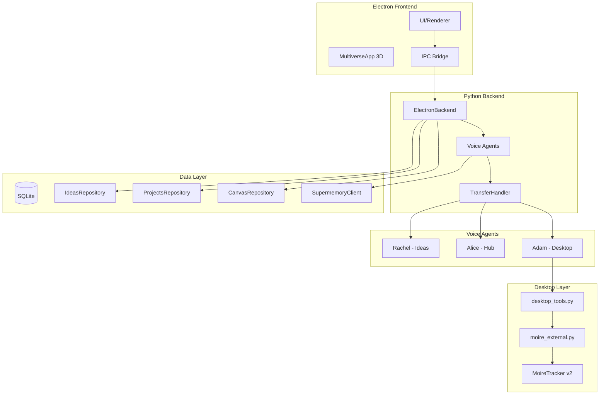
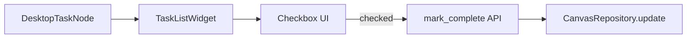
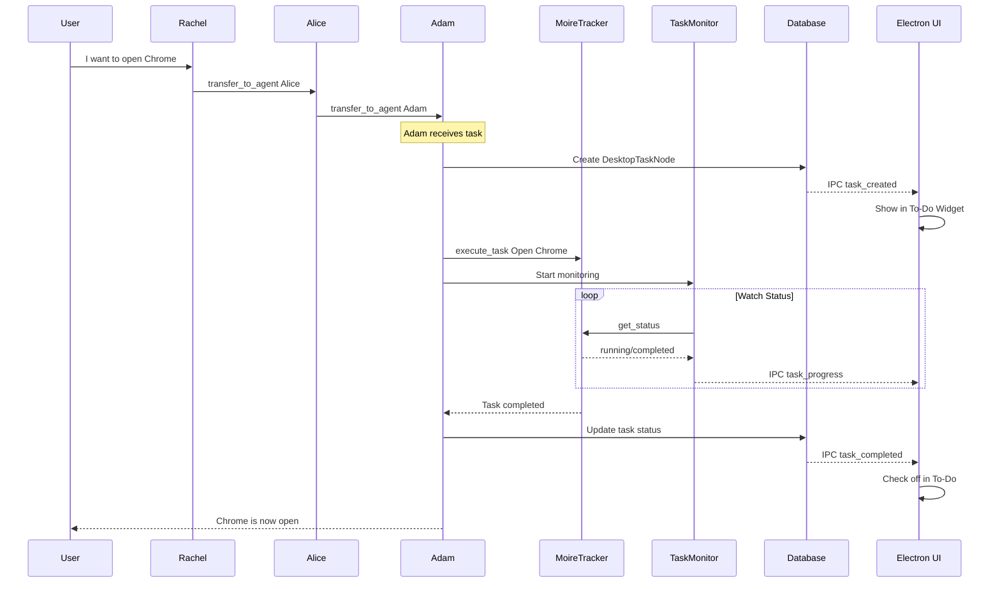

# Desktop Automation Architecture Plan

## Executive Summary

Dieses Dokument beschreibt die Integration der "Conversational AI for Desktop Automation" Spezifikation in das bestehende VibeMind-System.

---

## 1. Bestehende Architektur



### Komponenten-Status

| Komponente | Datei | Status |
|------------|-------|--------|
| Voice Agents | `agents/rachel/`, `agents/alice/` | ✅ Vorhanden |
| Desktop Tools | `tools/desktop_tools.py` | ✅ Vorhanden |
| MoireTracker Bridge | `moire_external.py` | ✅ Vorhanden |
| Transfer Handler | `tools/transfer_handler.py` | ✅ Vorhanden |
| Canvas Repository | `data/repository.py` | ✅ Vorhanden |
| Supermemory | `memory/supermemory_client.py` | ✅ Vorhanden |
| Task Progress Monitor | - | ❌ Fehlt |
| To-Do Widget | - | ❌ Fehlt |
| Claude Skills | - | ❌ Fehlt |

---

## 2. Spezifikation → Implementierung Mapping

### 2.1 Task Nodes erstellen

**Spezifikation:**
> The AI should allow users to create nodes that represent individual tasks

**Bestehende Basis:** `CanvasRepository` und `CanvasNode` Model

**Erweiterung benötigt:**
```python
# Neuer Node-Typ: desktop_task
class DesktopTaskNode(CanvasNode):
    task_goal: str           # "Öffne Chrome"
    task_status: str         # pending, running, completed, failed
    task_id: Optional[str]   # MoireTracker task_id
    created_by_agent: str    # "Adam"
```

### 2.2 To-Do Widget

**Spezifikation:**
> Transform nodes into a to-do widget that users can interact with

**Integration:**


**Neue Komponenten:**
- `electron-app/renderer/todo-widget.js` - UI Component
- `python/tools/task_tools.py` - Task CRUD Operations
- IPC Message: `task_status_changed`

### 2.3 Progress Monitoring

**Spezifikation:**
> The AI needs to determine when a desktop automation task has successfully ended

**Implementierung:**
```python
# python/tools/task_monitor.py
class TaskMonitor:
    def __init__(self, task_id: str, on_complete: Callable, on_error: Callable):
        self.task_id = task_id
        self.on_complete = on_complete
        self.on_error = on_error
        
    async def watch(self):
        """Polling loop für Task-Status"""
        while True:
            status = moire.get_status()
            if status['completed']:
                await self.on_complete(status)
                break
            elif status['error']:
                await self.on_error(status)
                break
            await asyncio.sleep(0.5)
```

### 2.4 Enter the Sun - Desktop Space

**Spezifikation:**
> Users should have a clear option to enter the sun

**Bestehende Basis:** `spaces.desktop` in MultiverseApp

**Erweiterung:**
- Click auf Light Planet → Desktop Panel öffnen
- Desktop Panel zeigt: Running Tasks, Task History, Quick Actions
- Embedded: VNC Preview für Sandbox

### 2.5 Super Memory Enhancement

**Spezifikation:**
> Remember user preferences and frequently used commands

**Bestehende Basis:** `SupermemoryClient`

**Erweiterung:**
```python
# Neue Methoden hinzufügen
def store_desktop_command(self, command: str, success: bool):
    """Speichert ausgeführte Desktop-Befehle"""
    
def get_frequent_commands(self, limit: int = 10):
    """Holt häufig genutzte Befehle"""
```

### 2.6 Claude Code Skills

**Spezifikation:**
> Leverage Clawed Code skills as conceptualized by Anthropic

**Neue Komponente:**
```python
# python/skills/claude_skills.py
class ClaudeSkills:
    def __init__(self, api_key: str):
        self.client = anthropic.Client(api_key)
        
    async def execute_complex_task(self, task: str) -> Dict:
        """Verwendet Claude für Multi-Step Reasoning"""
        
    async def generate_automation_script(self, goal: str) -> str:
        """Generiert PyAutoGUI Script"""
```

---

## 3. System Flow - Voice to Desktop Automation



---

## 4. Neue Dateistruktur

```
python/
├── tools/
│   ├── desktop_tools.py     # ✅ Existiert
│   ├── task_tools.py        # 🆕 Task CRUD für To-Do
│   └── task_monitor.py      # 🆕 Progress Monitoring
├── skills/
│   └── claude_skills.py     # 🆕 Claude Integration
├── memory/
│   └── supermemory_client.py # ✅ Existiert - erweitern
└── data/
    └── models.py            # ✅ Existiert - erweitern

electron-app/
└── renderer/
    ├── multiverse.js        # ✅ Existiert
    ├── todo-widget.js       # 🆕 To-Do Widget UI
    └── desktop-panel.js     # 🆕 Desktop Space Panel
```

---

## 5. IPC Messages (neu)

| Message Type | Direction | Payload |
|--------------|-----------|---------|
| `task_created` | Python→Electron | `{task_id, goal, status}` |
| `task_progress` | Python→Electron | `{task_id, progress, phase}` |
| `task_completed` | Python→Electron | `{task_id, success, duration}` |
| `task_failed` | Python→Electron | `{task_id, error}` |
| `update_task` | Electron→Python | `{task_id, updates}` |
| `get_tasks` | Electron→Python | `{filter}` |
| `tasks_list` | Python→Electron | `{tasks: [...]}` |

---

## 6. Implementierungs-Phasen

### Phase 1: Task Management Foundation (3-4 Stunden)
1. DesktopTaskNode Model erweitern
2. task_tools.py mit CRUD Operations
3. IPC Messages für Tasks

### Phase 2: Progress Monitoring (2-3 Stunden)
1. TaskMonitor Klasse
2. MoireTracker Status-Integration
3. Real-time Updates an Electron

### Phase 3: To-Do Widget UI (3-4 Stunden)
1. todo-widget.js Component
2. CSS Styling
3. Integration in Desktop Space

### Phase 4: Desktop Panel (2-3 Stunden)
1. desktop-panel.js
2. Click-Handler für Light Planet
3. Task History View

### Phase 5: Memory Enhancement (1-2 Stunden)
1. Command History in Supermemory
2. Häufige Befehle abrufen
3. Kontext für Adam bereitstellen

### Phase 6: Claude Skills (Optional, 4-5 Stunden)
1. Anthropic API Integration
2. Multi-Step Task Reasoning
3. Script Generation

---

## 7. Risiken und Mitigationen

| Risiko | Wahrscheinlichkeit | Mitigation |
|--------|-------------------|------------|
| MoireTracker instabil | Mittel | Fallback auf pyautogui direkt |
| Claude API Kosten | Hoch | Caching, Rate Limiting |
| Task-Monitoring Overhead | Niedrig | Polling-Intervall anpassen |
| UI-Performance | Niedrig | Lazy Loading für Task History |

---

## 8. Empfohlene Reihenfolge

1. **Sofort:** Phase 1 (Task Foundation) - Grundlage für alles
2. **Woche 1:** Phase 2 + 3 (Monitoring + Widget)
3. **Woche 2:** Phase 4 + 5 (Panel + Memory)
4. **Optional:** Phase 6 (Claude Skills)

---

*Erstellt: 2024-12-10*
*Autor: Architect Mode*