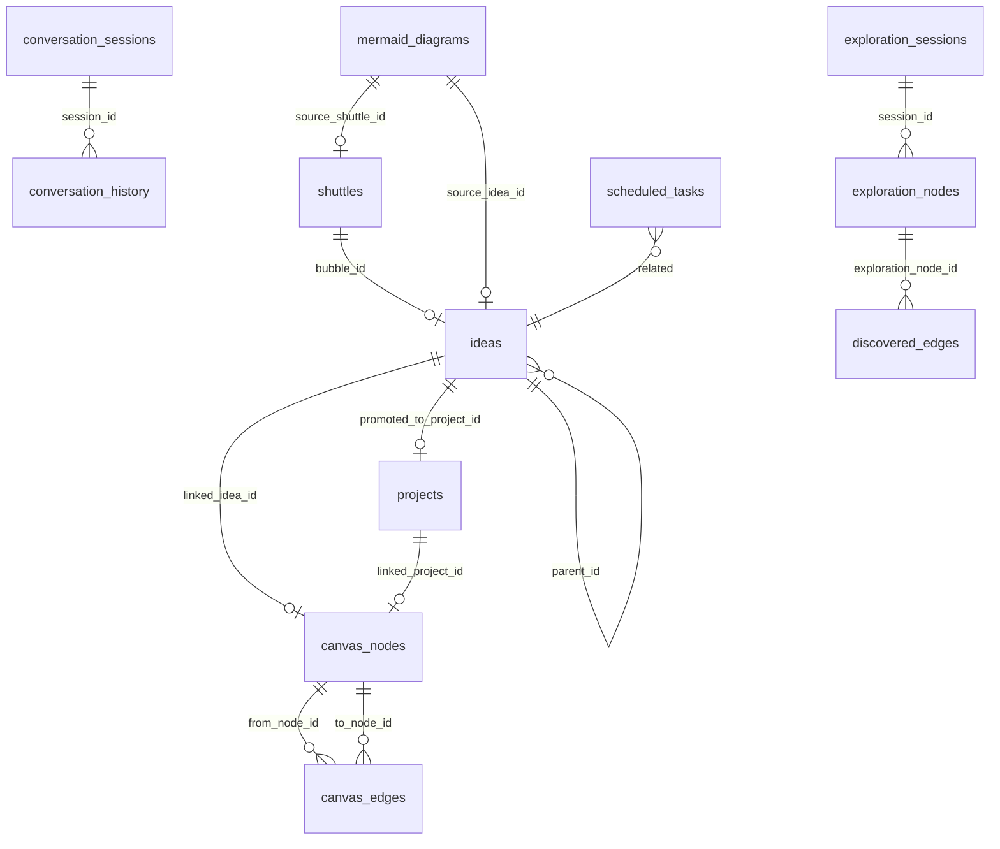

# Database Schema Reference

SQLite database at `python/vibemind.db`. Schema version: 14.

## ER Diagram

## Tables

### ideas

| Column | Type | Nullable | Description |
|--------|------|----------|-------------|
| id | TEXT | PK | UUID |
| title | TEXT | No | Name |
| description | TEXT | Yes | Content body |
| source | TEXT | Yes | `voice` / `text` |
| created_at | TEXT | No | ISO timestamp |
| score | REAL | Yes | Composite score (0-100) |
| status | TEXT | Yes | `active` / `archived` / `promoted` |
| parent_id | TEXT | FK→ideas.id | Parent bubble (null = root) |
| tags | TEXT | Yes | JSON array |
| metadata | TEXT | Yes | JSON object |
| agent_id | TEXT | Yes | Creating agent name |
| format_schema | TEXT | Yes | JSON format definition |
| content_json | TEXT | Yes | Structured content |
| embedding_vector | BLOB | Yes | Semantic embedding |
| embedding_hash | TEXT | Yes | Cache key |

### projects

| Column | Type | Description |
|--------|------|-------------|
| id | TEXT PK | UUID |
| name | TEXT | Project name |
| description | TEXT | Description |
| generation_status | TEXT | `pending` / `generating` / `complete` / `error` |
| from_idea_id | TEXT FK→ideas.id | Source idea |
| project_path | TEXT | Filesystem path |
| vnc_port | INTEGER | VNC preview port |
| preview_url | TEXT | Live preview URL |
| tech_stack | TEXT | Detected technologies |
| job_id | TEXT | Coding engine job ID |
| requirements_json | TEXT | JSON requirements spec |
| convergence_progress | REAL | Generation progress (0-100) |

### canvas_nodes

| Column | Type | Description |
|--------|------|-------------|
| id | TEXT PK | UUID |
| node_type | TEXT | `idea` / `project` / `note` / `image` / `link` |
| title | TEXT | Display title |
| content | TEXT | Body content |
| x, y | REAL | 3D position |
| linked_idea_id | TEXT FK→ideas.id | Linked idea |
| linked_project_id | TEXT FK→projects.id | Linked project |
| format_schema | TEXT | JSON format definition |
| content_json | TEXT | Structured content |

### canvas_edges

| Column | Type | Description |
|--------|------|-------------|
| id | TEXT PK | UUID |
| from_node_id | TEXT FK | Source node |
| to_node_id | TEXT FK | Target node |
| edge_type | TEXT | `related` / `parent` / `depends_on` |

### conversation_sessions

| Column | Type | Description |
|--------|------|-------------|
| id | TEXT PK | UUID |
| started_at | TEXT | ISO timestamp |
| ended_at | TEXT | ISO timestamp |
| summary | TEXT | Session summary |
| agent_id | TEXT | Voice agent name |

### conversation_history

| Column | Type | Description |
|--------|------|-------------|
| id | TEXT PK | UUID |
| session_id | TEXT FK | Session reference |
| speaker | TEXT | `user` / `agent` |
| text | TEXT | Message text |
| timestamp | TEXT | ISO timestamp |
| metadata | TEXT | JSON metadata |

### shuttles

| Column | Type | Description |
|--------|------|-------------|
| shuttle_id | TEXT PK | UUID |
| bubble_id | TEXT FK | Source bubble |
| bubble_name | TEXT | Bubble display name |
| status | TEXT | `launching` / `in_transit` / `arrived` / `needs_work` |
| current_stage | TEXT | `mining` / `requirements` / `validation` / `knowledge_graph` / `techstack` / `complete` |
| score | REAL | Evaluation score |
| requirement_results | TEXT | JSON results |

### exploration_sessions

AI-Scientist exploration session state.

| Column | Type | Description |
|--------|------|-------------|
| id | TEXT PK | UUID |
| root_bubble_id | TEXT FK→ideas.id | Starting bubble for exploration |
| root_bubble_title | TEXT | Display title of root bubble |
| exploration_query | TEXT | User query driving exploration |
| status | TEXT | `exploring` / `paused` / `completed` / `cancelled` |
| current_stage | TEXT | Current exploration stage |
| created_at | TEXT | ISO timestamp |
| completed_at | TEXT | ISO timestamp (null if ongoing) |
| total_nodes_explored | INTEGER | Count of nodes visited |
| best_score | REAL | Highest combined score found |
| metadata | TEXT | JSON object with extra state |

### exploration_nodes

Individual exploration steps within a session.

| Column | Type | Description |
|--------|------|-------------|
| id | TEXT PK | UUID |
| session_id | TEXT FK→exploration_sessions.id | Parent session |
| step | INTEGER | Step index in session |
| parent_node_id | TEXT FK→exploration_nodes.id | Previous step (null for root) |
| source_bubble_id | TEXT FK→ideas.id | Source bubble being explored from |
| source_bubble_title | TEXT | Display title of source |
| target_bubble_id | TEXT FK→ideas.id | Target bubble discovered |
| target_bubble_title | TEXT | Display title of target |
| connection_type | TEXT | Type of discovered connection |
| reasoning | TEXT | LLM reasoning for connection |
| edge_label | TEXT | Human-readable edge label |
| embedding_similarity | REAL | Cosine similarity score |
| llm_confidence | REAL | LLM confidence score |
| combined_score | REAL | Weighted combined score |
| exploration_depth | INTEGER | Depth from root |
| is_accepted | BOOLEAN | User accepted this node |
| is_rejected | BOOLEAN | User rejected this node |
| is_valid | BOOLEAN | Validation status |
| created_at | TEXT | ISO timestamp |
| metadata | TEXT | JSON object |

### discovered_edges

Edges found during exploration, candidates for permanent canvas_edges.

| Column | Type | Description |
|--------|------|-------------|
| id | TEXT PK | UUID |
| from_idea_id | TEXT FK→ideas.id | Source idea |
| to_idea_id | TEXT FK→ideas.id | Target idea |
| edge_type | TEXT | `related` / `causal` / `depends_on` / `similar` |
| edge_label | TEXT | Human-readable label |
| reasoning | TEXT | LLM reasoning for this edge |
| confidence | REAL | Confidence score (0-1) |
| connection_type | TEXT | Discovery method |
| exploration_session_id | TEXT FK→exploration_sessions.id | Owning session |
| exploration_node_id | TEXT FK→exploration_nodes.id | Owning node |
| created_at | TEXT | ISO timestamp |
| metadata | TEXT | JSON object |

### mermaid_diagrams

Generated diagram storage for visualization exports.

| Column | Type | Description |
|--------|------|-------------|
| id | TEXT PK | UUID |
| title | TEXT | Diagram title |
| diagram_type | TEXT | `flowchart` / `sequence` / `class` / `er` / `gantt` / `mindmap` |
| content | TEXT | Mermaid diagram source |
| source_idea_id | TEXT FK→ideas.id | Originating idea (nullable) |
| source_shuttle_id | TEXT FK→shuttles.shuttle_id | Originating shuttle (nullable) |
| source_requirement_ids | TEXT | JSON array of requirement IDs |
| created_at | TEXT | ISO timestamp |
| updated_at | TEXT | ISO timestamp |
| version | INTEGER | Diagram version number |
| metadata | TEXT | JSON object |

### scheduled_tasks

| Column | Type | Description |
|--------|------|-------------|
| id | TEXT PK | UUID |
| title | TEXT | Task name |
| description | TEXT | Task description |
| action_text | TEXT | Voice command to execute |
| execution_mode | TEXT | `sync` / `async` |
| trigger_type | TEXT | `date` / `cron` / `interval` |
| trigger_config | TEXT | JSON trigger definition |
| timezone | TEXT | IANA timezone (e.g. `Europe/Berlin`) |
| status | TEXT | `active` / `paused` / `completed` / `cancelled` |
| next_run_at | TEXT | Next execution time |
| last_run_at | TEXT | Last execution time |
| run_count | INTEGER | Number of times executed |
| max_runs | INTEGER | Max executions (null = unlimited) |
| last_result | TEXT | JSON result of last execution |
| last_error | TEXT | Error message from last failure |
| created_at | TEXT | ISO timestamp |
| updated_at | TEXT | ISO timestamp |
| metadata | TEXT | JSON object |
