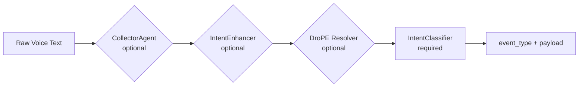

# Intent Classification Pipeline

## Overview

The intent pipeline transforms raw voice text into a structured `(event_type, payload)` pair. It has one required stage (classification) and three optional preprocessing stages.

## Pipeline Flow



## Stages

### 1. CollectorAgent (Optional)

Accumulates fragmented speech. If the user says short fragments (<3 words), it buffers them before classification.

- **Enable:** `USE_INTENT_ANALYSIS=true`
- **File:** `python/swarm/agents/collector_agent.py`

### 2. IntentEnhancer (Optional)

Fixes common ASR (Automatic Speech Recognition) errors and normalizes dialect variations:
- "Babbel" → "Bubble"
- "erstell" → "erstelle"

- **Enable:** `USE_INTENT_ANALYSIS=true`
- **File:** `python/swarm/agents/intent_enhancer.py`

### 3. DroPE Reference Resolver (Optional)

Resolves ambiguous references using conversation history:
- "Mach das nochmal" → "Erstelle Bubble Marketing" (repeats last action)
- "Lösch es" → "Lösche Bubble Test" (resolves "es" from context)

- **Enable:** `USE_DROPE_RESOLVER=true`
- **File:** `python/swarm/orchestrator/reference_resolver.py`
- **Model:** `SakanaAI/DroPE-SmolLM-135M-32K`

### 4. IntentClassifier (Required)

LLM-based classification using a structured prompt. The prompt includes:
- All valid event types grouped by domain
- Parameter schemas per event type
- Example utterances in German and English
- Instructions for the LLM to output JSON

**Input:** `"Erstelle eine Bubble Marketing"`

**Output:**
```json
{
  "event_type": "bubble.create",
  "params": {"title": "Marketing"},
  "confidence": 0.95,
  "response_hint": "Bubble Marketing wird erstellt"
}
```

- **File:** `python/swarm/orchestrator/intent_classifier.py`
- **Prompt:** `CLASSIFIER_PROMPT_TEMPLATE` (contains all event types and examples)

## Event Type Taxonomy

| Domain | Prefix | Examples |
|--------|--------|----------|
| Bubbles | `bubble.*` | `bubble.create`, `bubble.enter`, `bubble.list`, `bubble.exit` |
| Ideas | `idea.*` | `idea.create`, `idea.find`, `idea.auto_link`, `idea.format_*` |
| Coding | `code.*` | `code.generate`, `code.status`, `code.preview.*` |
| Desktop | `desktop.*` | `desktop.open_app`, `desktop.click`, `desktop.screenshot` |
| Messaging | `messaging.*` | `messaging.whatsapp`, `messaging.telegram` |
| Web | `web.*` | `web.search`, `web.fetch` |
| Roarboot | `roarboot.*` | `roarboot.query`, `roarboot.explore` |
| Research | `research.*` | `research.web`, `research.summarize` |
| Minibook | `minibook.*` | `minibook.coordinate`, `minibook.status` |
| Schedule | `schedule.*` | `schedule.create`, `schedule.list` |

See [docs/api/event-types.md](../api/event-types.md) for the complete reference.
