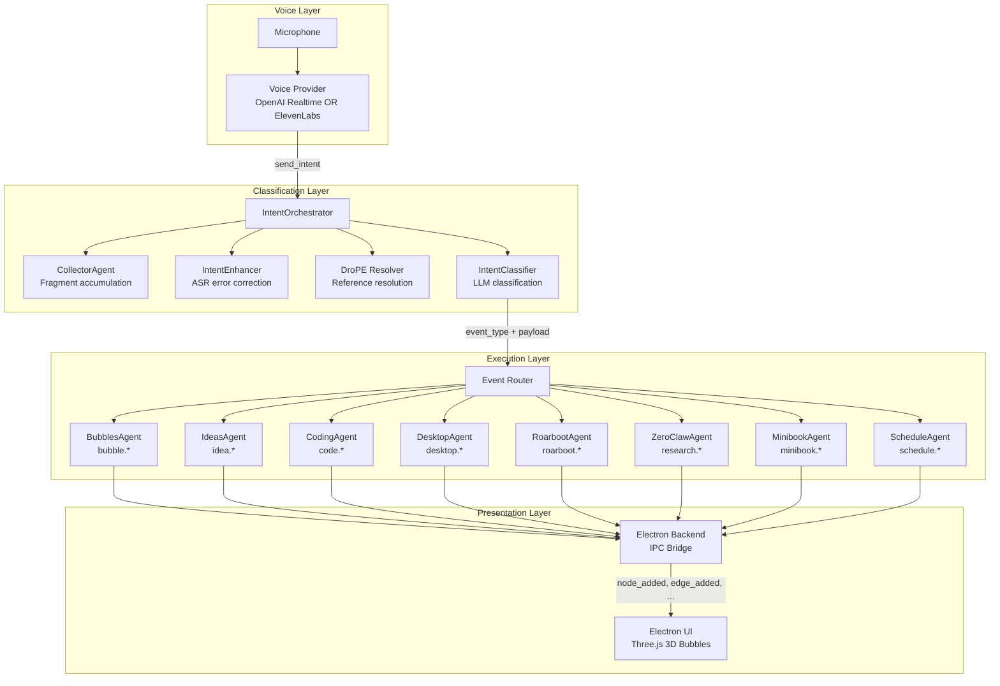

# Architecture Overview

VibeMind is a voice-first workspace built on four layers: Voice, Classification, Execution, and Presentation.

## System Diagram

## Layer Responsibilities

### 1. Voice Layer
- Dual provider: OpenAI Realtime API (speech-to-speech) or ElevenLabs (multi-agent voice)
- `VOICE_PROVIDER` env var selects provider (`openai_realtime` or `elevenlabs`)
- OpenAI mode: Rachel voice agent with `send_intent(user_request)` tool
- ElevenLabs mode: 4 agents (Rachel, Alice, Adam, Antoni) with transfer capabilities
- Voice activity detection (VAD) handles turn-taking automatically

### 2. Classification Layer
- **IntentOrchestrator** coordinates preprocessing and classification
- **IntentClassifier** uses an LLM to map natural language to structured `event_type` + `payload`
- Optional pipeline: CollectorAgent (fragment batching) → IntentEnhancer (ASR correction) → DroPE (reference resolution)

### 3. Execution Layer
- **Event Router** maps `event_type` prefix to the correct backend agent stream
- **Backend Agents** (IdeasAgent, CodingAgent, DesktopAgent, etc.) execute tools via `TOOL_MAP`
- Sync mode: direct function call. Async mode: Redis stream publish/consume

### 4. Presentation Layer
- **Electron Backend** (`electron_backend.py`) receives tool results and broadcasts JSON messages to Electron
- **Electron Main** (`main.js`) spawns Python as child process, routes IPC messages
- **Renderer** (Three.js) renders bubbles/ideas as 3D glass objects in a navigable scene

## Key Design Decisions

| Decision | Rationale |
|----------|-----------|
| Dual voice provider (OpenAI Realtime / ElevenLabs) | OpenAI for low-latency single-agent; ElevenLabs for multi-agent with transfers |
| LLM-based classification | Flexible — new event types added by editing a prompt, no model retraining |
| Space-based architecture | Each domain is isolated with its own agent, tools, and event types |
| Sync/async dual mode | Sync for zero-dep local dev; async for production scalability |
| SQLite | Good enough for single-user desktop app; no server dependency |
| stdin/stdout IPC | Simplest cross-platform Electron↔Python bridge |
