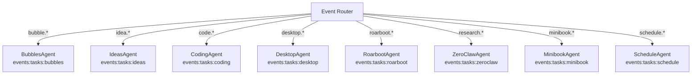

# Swarm Backend

## Overview

The swarm backend executes tools in response to classified intents. Each domain has a dedicated backend agent that maps event types to tool functions.

## Architecture



## BaseBackendAgent

All agents extend `BaseBackendAgent`:

```python
class BaseBackendAgent(ABC):
    stream: str         # Redis stream to consume from
    name: str           # Agent name for logging
    TOOL_MAP: Dict      # event_type → tool_function_name
    PARAM_MAPPING: Dict # event_type → {classifier_param: tool_param}

    async def _handle_event(event):
        tool_name = TOOL_MAP[event.event_type]
        params = _normalize_params(event.event_type, event.params)
        result = tools[tool_name](**params)
```

### Key Methods

| Method | Purpose |
|--------|---------|
| `_handle_event(event)` | Main event handler — maps, normalizes, executes |
| `_normalize_params(event_type, params)` | Renames classifier params to tool params via PARAM_MAPPING |
| `_extract_params_from_transcript(event_type, user_input)` | Fallback: regex extraction from raw text |
| `_resolve_context_references(event_type, user_input, params, history)` | Resolves "alle", "das" from conversation |
| `_load_tools()` | Abstract — each agent loads its tool functions |

## Execution Modes

### Sync Mode (`FORCE_SYNC_MODE=true`)

```
IntentClassifier → Event Router → Agent._handle_event() → Tool → Result
```

Direct function call. No Redis needed. Default for local development.

### Async Mode (`FORCE_SYNC_MODE=false`)

```
IntentClassifier → Event Router → Redis Stream → Agent Consumer → Tool → Result → Redis Status
```

Uses Redis consumer groups. Allows distributed processing and multiple agent instances.

## Tool Execution Flow

1. **Map:** `event_type` → `tool_function_name` via `TOOL_MAP`
2. **Normalize:** Rename classifier params to tool params via `PARAM_MAPPING`
3. **Fallback:** If params missing, extract from raw transcript
4. **Execute:** Call tool function with normalized params
5. **Broadcast:** Tool calls `_broadcast_to_electron()` for UI updates
6. **Return:** Result dict with `success`, `message`, optional data

## Key Files

| File | Purpose |
|------|---------|
| `python/swarm/backend_agents/base_agent.py` | BaseBackendAgent abstract class |
| `python/spaces/ideas/agents/bubbles_agent.py` | Bubbles space |
| `python/spaces/ideas/agents/ideas_agent.py` | Ideas space (70+ event mappings) |
| `python/spaces/coding/agents/coding_agent.py` | Coding space |
| `python/spaces/desktop/agents/desktop_agent.py` | Desktop space |
| `python/spaces/rowboat/agents/roarboot_agent.py` | Roarboot space |
| `python/spaces/research/agents/zeroclaw_research_agent.py` | Research space |
| `python/spaces/minibook/agents/minibook_agent.py` | Minibook space |
| `python/spaces/schedule/agents/schedule_agent.py` | Schedule space |
| `python/swarm/event_team/event_router.py` | Routes events to agent streams |
| `python/swarm/event_bus.py` | Redis stream abstraction |
