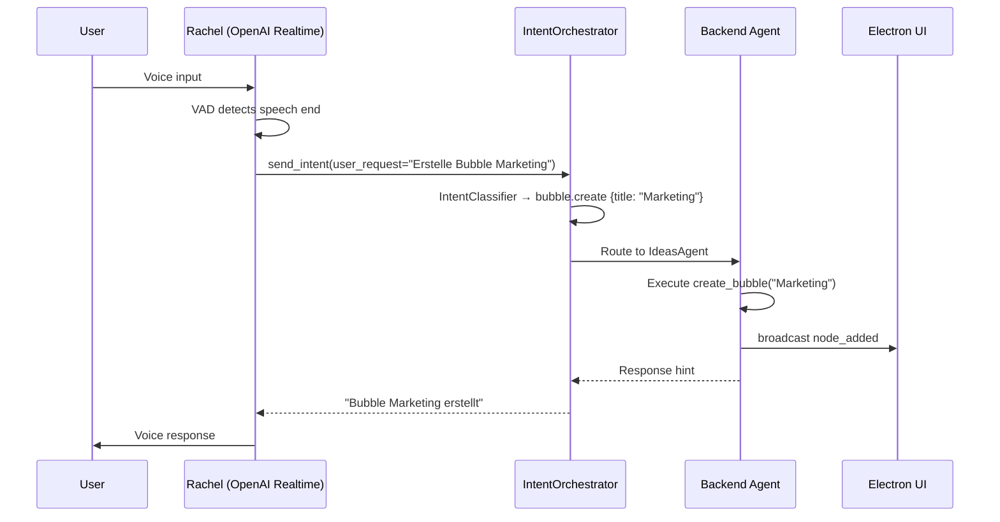

# Voice Layer

## Overview

VibeMind supports two voice providers, selected via the `VOICE_PROVIDER` environment variable:

- **OpenAI Realtime** (`VOICE_PROVIDER=openai_realtime`) -- Single agent (Rachel) with speech-to-speech and native function calling
- **ElevenLabs** (`VOICE_PROVIDER=elevenlabs`) -- Multi-agent system with 4 voice agents and transfer capabilities

## Provider: OpenAI Realtime

The OpenAI Realtime API provides speech-to-speech voice interaction. The voice agent ("Rachel") captures user speech, transcribes it, and calls a `send_intent` function tool that routes the request to the swarm backend.

## Sequence Diagram



## Configuration

```bash
# .env
VOICE_PROVIDER=openai_realtime
OPENAI_API_KEY=sk-xxx
OPENAI_REALTIME_MODEL=gpt-4o-realtime-preview
OPENAI_REALTIME_VOICE=alloy   # alloy, echo, fable, onyx, nova, shimmer
```

## The send_intent Tool

Rachel has a single function tool registered with the Realtime API:

```json
{
  "type": "function",
  "name": "send_intent",
  "description": "Route the user's request to the VibeMind swarm backend for execution",
  "parameters": {
    "type": "object",
    "properties": {
      "user_request": {
        "type": "string",
        "description": "The user's request in their original language"
      }
    },
    "required": ["user_request"]
  }
}
```

When the user speaks, Rachel decides whether to call `send_intent` or respond conversationally. Tool calls flow to `IntentOrchestrator.handle_intent()`.

## Provider: ElevenLabs

ElevenLabs mode provides a multi-agent voice system with 4 agents that can transfer conversations between each other.

### Agent Topology

```
Rachel (Entry) ──transfer──> Alice (Hub)
                               │
                    ┌──────────┴──────────┐
                    v                      v
               Adam (Desktop)        Antoni (Coding)
```

| Agent | Role | Transfers To |
|-------|------|--------------|
| Rachel | Multiverse Navigator (Entry) | Alice |
| Alice | Coordinator Hub | Adam, Antoni, Rachel |
| Adam | Desktop Worker | Alice |
| Antoni | Coding/Writing | Alice |

### Configuration

```bash
# .env
VOICE_PROVIDER=elevenlabs
ELEVENLABS_API_KEY=xxx
AGENT_MULTIVERSE=agent_xxx  # Rachel's agent ID
```

Agent configs are in `python/agents/{name}/config.py`, `prompts.py`, and `tools.py`.

## VoiceBridgeV2

When `USE_VOICE_BRIDGE_V2=true` is set, VibeMind uses an async notification mode for voice-to-backend communication. Instead of synchronous tool calls blocking the voice agent, the bridge publishes intents asynchronously and notifies the voice agent when results are ready.

```bash
# .env
USE_VOICE_BRIDGE_V2=true
```

## Key Files

| File | Purpose |
|------|---------|
| `python/core/voice/` | OpenAI Realtime session management |
| `python/tools/swarm_entry.py` | `send_intent` tool implementation |
| `python/swarm/orchestrator/intent_orchestrator.py` | Entry point for intent processing |
| `python/agents/` | ElevenLabs agent configs (rachel, alice, adam, antoni) |
