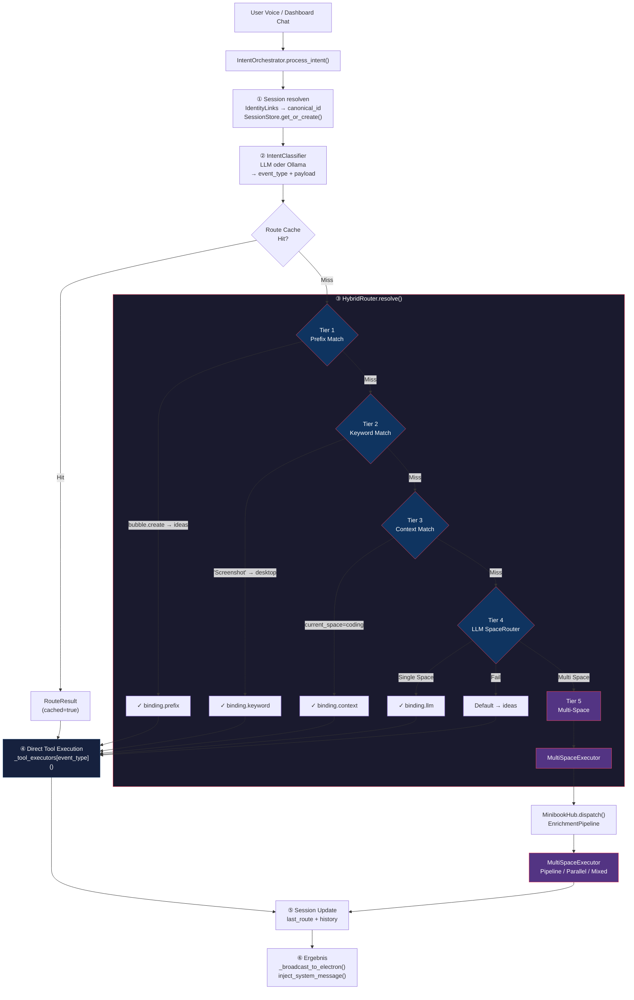
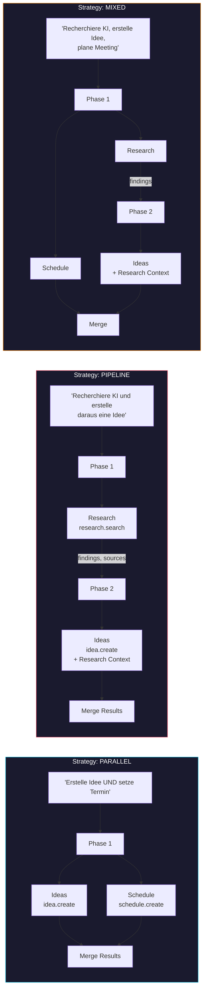
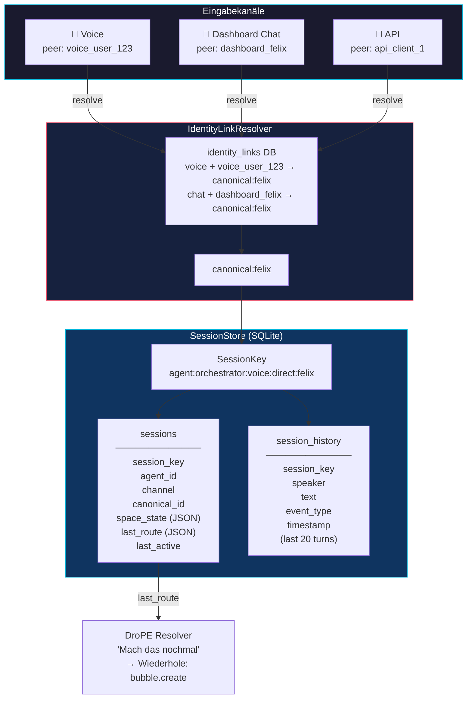
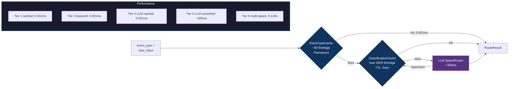
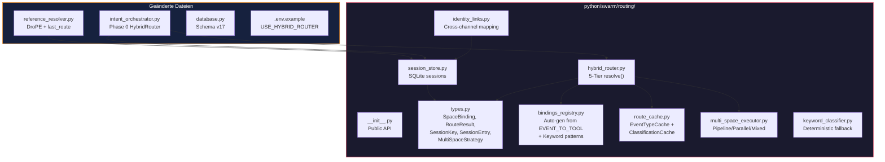
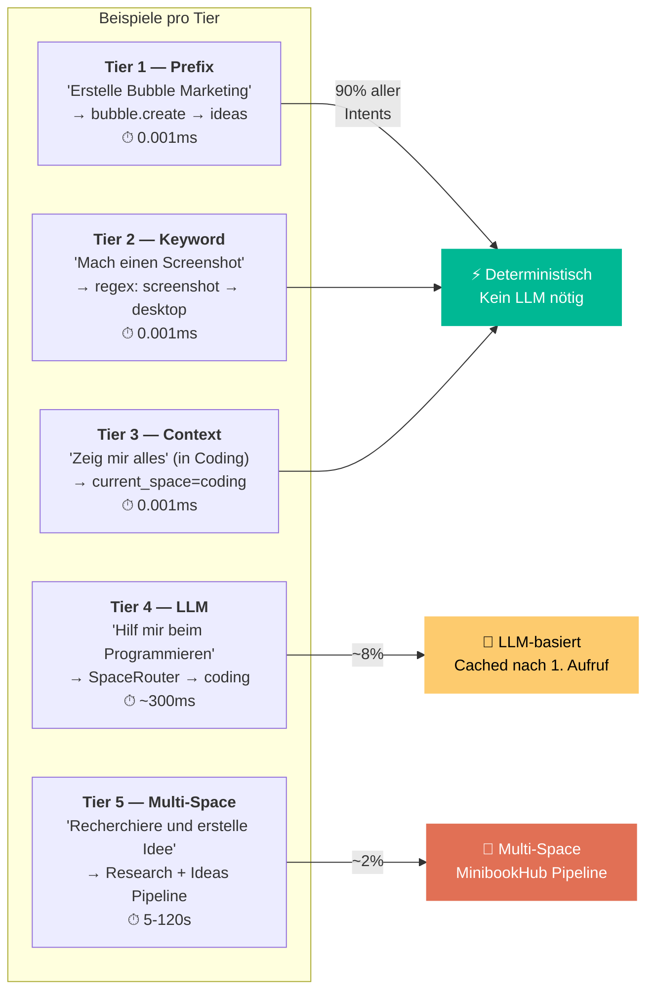

# HybridRouter — Architecture Diagrams

## 1. Hauptfluss: 5-Tier Routing

## 2. Multi-Space Strategien

## 3. Session Management + Identity Links

## 4. Cache-Architektur

## 5. Dateistruktur

## 6. Tier-Entscheidungsmatrix

