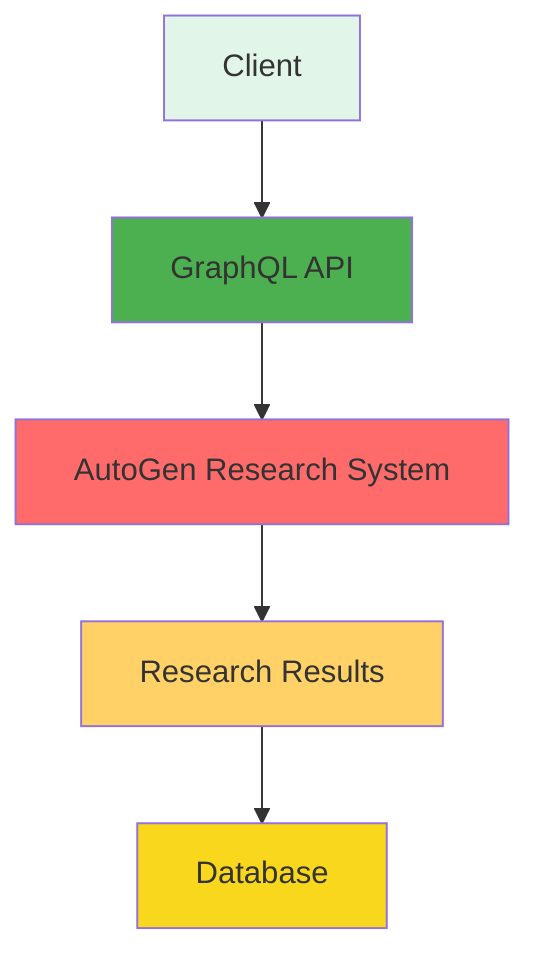

# GraphQL-Integration für AutoGen-System

## Übersicht

Dieses Dokument beschreibt, wie man das AutoGen-Research-System in die VibeMind-VoiceDialog Anwendung integrieren kann, um die Forschungsergebnisse über GraphQL bereitzustellen.

## Architektur



## GraphQL Schema

### Types

```graphql
type ResearchRequest {
  id: ID!
  topic: String!
  requirements: [String!]!
  language: String
  maxConcurrentWorkers: Int
  createdAt: DateTime!
}

type ResearchResult {
  id: ID!
  requestId: ID!
  topic: String!
  requirements: RequirementsDocument!
  paper: ResearchPaper!
  qualityReport: QualityReport!
  agentCount: Int!
  message: String!
  success: Boolean!
  createdAt: DateTime!
}

type RequirementsDocument {
  title: String!
  content: String!
  features: [String!]!
}

type ResearchPaper {
  title: String!
  abstract: String!
  content: String!
}

type QualityReport {
  overallScore: Float!
  content: String!
  criteria: QualityCriteria!
}

type QualityCriteria {
  completeness: Float!
  accuracy: Float!
  relevance: Float!
}
```

### Queries

```graphql
type Query {
  # Forschungsanfrage starten
  startResearch(
    topic: String!
    requirements: [String!]!
    language: String
    maxConcurrentWorkers: Int
  ): ResearchRequest!

  # Forschungsergebnisse abrufen
  getResearchResult(
    id: ID!
  ): ResearchResult

  # Alle Forschungsergebnisse abrufen
  getAllResearchResults(
    limit: Int
    offset: Int
  ): [ResearchResult!]!

  # Forschungsergebnisse nach Topic filtern
  getResearchResultsByTopic(
    topic: String!
    limit: Int
    offset: Int
  ): [ResearchResult!]!
}
```

### Mutations

```graphql
type Mutation {
  # Forschungsanfrage starten
  startResearch(
    topic: String!
    requirements: [String!]!
    language: String
    maxConcurrentWorkers: Int
  ): ResearchRequest!

  # Forschungsergebnis löschen
  deleteResearchResult(
    id: ID!
  ): Boolean!
}
```

### Subscriptions

```graphql
type Subscription {
  # Forschungsfortschritt abonnieren
  researchProgress(
    requestId: ID!
  ): ResearchProgress!

  # Forschungsergebnis abonnieren
  researchCompleted(
    requestId: ID!
  ): ResearchResult!
}
```

### Types

```graphql
type ResearchProgress {
  requestId: ID!
  status: String!
  currentAgent: String
  message: String!
  progress: Float!
  timestamp: DateTime!
}

enum ResearchStatus {
  INITIATED
  RUNNING
  COMPLETED
  FAILED
}
```

## Integration mit AutoGen

### 1. GraphQL Resolver erstellen

```python
# graphql/resolvers.py

from typing import List, Dict, Any
from datetime import datetime
import uuid

from swarm.tools.autogen_research import conduct_autogen_research


class ResearchResolver:
    """Resolver für AutoGen-Research-System."""
    
    async def start_research(
        self,
        topic: str,
        requirements: List[str],
        language: str = "de",
        max_concurrent_workers: int = 5
    ) -> Dict[str, Any]:
        """Starte eine Forschungsanfrage."""
        request_id = str(uuid.uuid4())
        
        # Starte Forschung im Hintergrund
        import asyncio
        asyncio.create_task(self._run_research_background(
            request_id,
            topic,
            requirements,
            language,
            max_concurrent_workers
        ))
        
        return {
            "id": request_id,
            "topic": topic,
            "requirements": requirements,
            "language": language,
            "maxConcurrentWorkers": max_concurrent_workers,
            "createdAt": datetime.utcnow().isoformat(),
            "success": True,
            "message": f"Forschung gestartet für: {topic}"
        }
    
    async def _run_research_background(
        self,
        request_id: str,
        topic: str,
        requirements: List[str],
        language: str,
        max_concurrent_workers: int
    ):
        """Führe Forschung im Hintergrund durch."""
        try:
            result = await conduct_autogen_research(
                topic=topic,
                requirements=requirements,
                language=language,
                max_concurrent_workers=max_concurrent_workers,
            )
            
            # Speichere Ergebnis in Datenbank
            await self._save_research_result(request_id, result)
            
        except Exception as e:
            # Speichere Fehler in Datenbank
            await self._save_research_error(request_id, str(e))
    
    async def get_research_result(
        self,
        result_id: str
    ) -> Dict[str, Any]:
        """Hole Forschungsergebnis."""
        # Hole Ergebnis aus Datenbank
        result_data = await self._get_research_result_from_db(result_id)
        
        if not result_data:
            return {
                "success": False,
                "message": f"Forschungsergebnis nicht gefunden: {result_id}"
            }
        
        return result_data
    
    async def get_all_research_results(
        self,
        limit: int = 10,
        offset: int = 0
    ) -> List[Dict[str, Any]]:
        """Hole alle Forschungsergebnisse."""
        # Hole alle Ergebnisse aus Datenbank
        results = await self._get_all_research_results_from_db(limit, offset)
        
        return results
    
    async def delete_research_result(
        self,
        result_id: str
    ) -> bool:
        """Lösche Forschungsergebnis."""
        # Lösche Ergebnis aus Datenbank
        success = await self._delete_research_result_from_db(result_id)
        
        return success
    
    async def _save_research_result(
        self,
        request_id: str,
        result: Dict[str, Any]
    ):
        """Speichere Forschungsergebnis in Datenbank."""
        # Implementiere Datenbank-Speicherung
        pass
    
    async def _get_research_result_from_db(
        self,
        result_id: str
    ) -> Dict[str, Any]:
        """Hole Forschungsergebnis aus Datenbank."""
        # Implementiere Datenbank-Abfrage
        pass
    
    async def _get_all_research_results_from_db(
        self,
        limit: int,
        offset: int
    ) -> List[Dict[str, Any]]:
        """Hole alle Forschungsergebnisse aus Datenbank."""
        # Implementiere Datenbank-Abfrage
        pass
    
    async def _delete_research_result_from_db(
        self,
        result_id: str
    ) -> bool:
        """Lösche Forschungsergebnis aus Datenbank."""
        # Implementiere Datenbank-Löschung
        pass
```

### 2. GraphQL Schema erstellen

```python
# graphql/schema.py

from strawberry import Schema
from typing import List, Optional
from datetime import datetime


@strawberry.type
class QualityCriteria:
    """Qualitätskriterien."""
    completeness: float
    accuracy: float
    relevance: float


@strawberry.type
class QualityReport:
    """Qualitätsbericht."""
    overall_score: float
    content: str
    criteria: QualityCriteria


@strawberry.type
class ResearchPaper:
    """Forschungspaper."""
    title: str
    abstract: str
    content: str


@strawberry.type
class RequirementsDocument:
    """Anforderungsdokument."""
    title: str
    content: str
    features: List[str]


@strawberry.type
class ResearchResult:
    """Forschungsergebnis."""
    id: str
    request_id: str
    topic: str
    requirements: RequirementsDocument
    paper: ResearchPaper
    quality_report: QualityReport
    agent_count: int
    message: str
    success: bool
    created_at: datetime


@strawberry.type
class ResearchRequest:
    """Forschungsanfrage."""
    id: str
    topic: str
    requirements: List[str]
    language: str
    max_concurrent_workers: int
    created_at: datetime


@strawberry.type
class Query:
    """GraphQL Queries."""
    start_research: ResearchRequest
    get_research_result: ResearchResult
    get_all_research_results: List[ResearchResult]
    get_research_results_by_topic: List[ResearchResult]


@strawberry.type
class Mutation:
    """GraphQL Mutations."""
    start_research: ResearchRequest
    delete_research_result: bool


schema = Schema(
    query=Query,
    mutation=Mutation
)
```

### 3. GraphQL Server erstellen

```python
# graphql/server.py

from fastapi import FastAPI
from fastapi.middleware.cors import CORSMiddleware
from strawberry.fastapi import GraphQLRouter
import uvicorn

from schema import schema
from resolvers import ResearchResolver


# Erstelle FastAPI App
app = FastAPI()

# Füge CORS Middleware hinzu
app.add_middleware(
    CORSMiddleware,
    allow_origins=["*"],
    allow_credentials=True,
    allow_methods=["*"],
    allow_headers=["*"],
)

# Erstelle GraphQL Router
graphql_app = GraphQLRouter(schema=schema)

# Füge GraphQL Router zu FastAPI hinzu
app.include_router(graphql_app, prefix="/graphql")

# Erstelle Resolver Instanz
research_resolver = ResearchResolver()


@app.get("/")
async def root():
    """Root Endpoint."""
    return {
        "message": "AutoGen Research GraphQL API",
        "version": "1.0.0",
        "endpoints": {
            "graphql": "/graphql",
            "health": "/health"
        }
    }


@app.get("/health")
async def health():
    """Health Check Endpoint."""
    return {
        "status": "healthy",
        "timestamp": datetime.utcnow().isoformat()
    }


if __name__ == "__main__":
    import uvicorn
    uvicorn.run(
        app,
        host="0.0.0.0",
        port=8000,
    )
```

### 4. Integration mit VibeMind

```python
# In der VibeMind-Anwendung

from graphql.client import Client as GraphQLClient

# Erstelle GraphQL Client
graphql_client = GraphQLClient(
    url="http://localhost:8000/graphql",
)

# Starte Forschung
async def start_research(topic: str, requirements: List[str]):
    """Starte Forschung über GraphQL."""
    mutation = """
    mutation StartResearch($topic: String!, $requirements: [String!]!, $language: String!, $maxConcurrentWorkers: Int!) {
        startResearch(
            topic: $topic
            requirements: $requirements
            language: $language
            maxConcurrentWorkers: $maxConcurrentWorkers
        ) {
            id
            topic
            requirements
            language
            maxConcurrentWorkers
            createdAt
            success
            message
        }
    }
    """
    
    result = await graphql_client.execute_async(mutation)
    
    return result.data["startResearch"]
```

## Implementierungsplan

### Phase 1: GraphQL Server erstellen
1. GraphQL Schema definieren
2. GraphQL Resolver implementieren
3. GraphQL Server mit FastAPI erstellen
4. CORS Middleware hinzufügen
5. Health Check Endpoint erstellen

### Phase 2: AutoGen-Integration
1. AutoGen-Research-System in GraphQL Resolver integrieren
2. Asynchrone Ausführung implementieren
3. Fehlerbehandlung implementieren
4. Logging implementieren

### Phase 3: Datenbank-Integration
1. Datenbank-Schema definieren
2. Datenbank-Operationen implementieren
3. Datenbank-Migrationen erstellen
4. Datenbank-Verbindungspool implementieren

### Phase 4: Client-Integration
1. GraphQL Client erstellen
2. Forschungsanfrage implementieren
3. Forschungsergebnisse abrufen
4. Subscriptions implementieren

### Phase 5: Testing
1. Unit Tests erstellen
2. Integration Tests erstellen
3. Performance Tests erstellen
4. Load Tests erstellen

## Vorteile der GraphQL-Integration

1. **Typsicherheit**: GraphQL bietet typsichere APIs
2. **Flexibilität**: Clients können genau die Daten abfragen, die sie benötigen
3. **Skalierbarkeit**: GraphQL Server können horizontal skaliert werden
4. **Real-time Updates**: Subscriptions ermöglichen real-time Updates
5. **Single Endpoint**: Alle Anfragen gehen über einen einzigen Endpoint
6. **Self-Documenting**: GraphQL Schema dokumentiert sich selbst

## Nächste Schritte

1. GraphQL Server erstellen und testen
2. AutoGen-Integration implementieren
3. Datenbank-Integration hinzufügen
4. Client-Integration implementieren
5. Testing durchführen
6. Dokumentation vervollständigen
