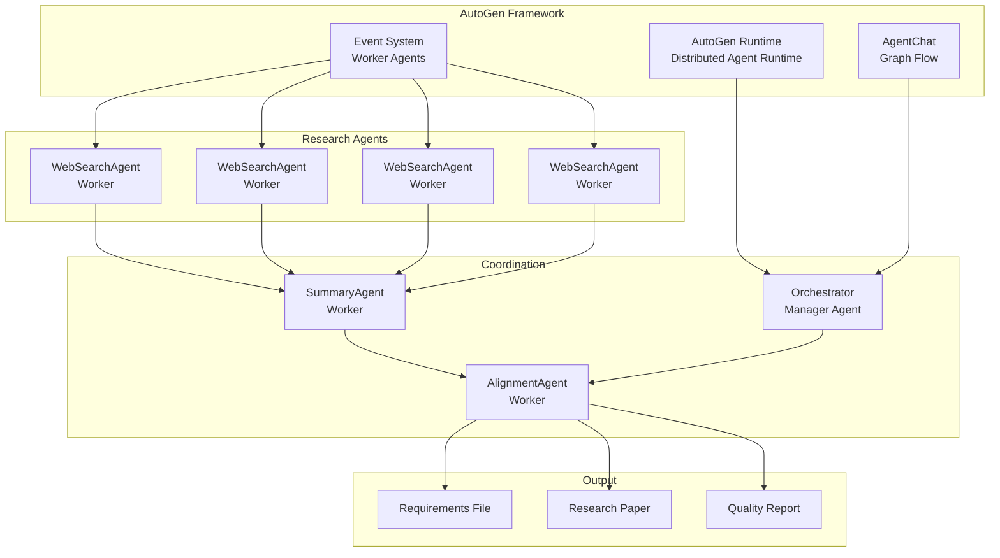
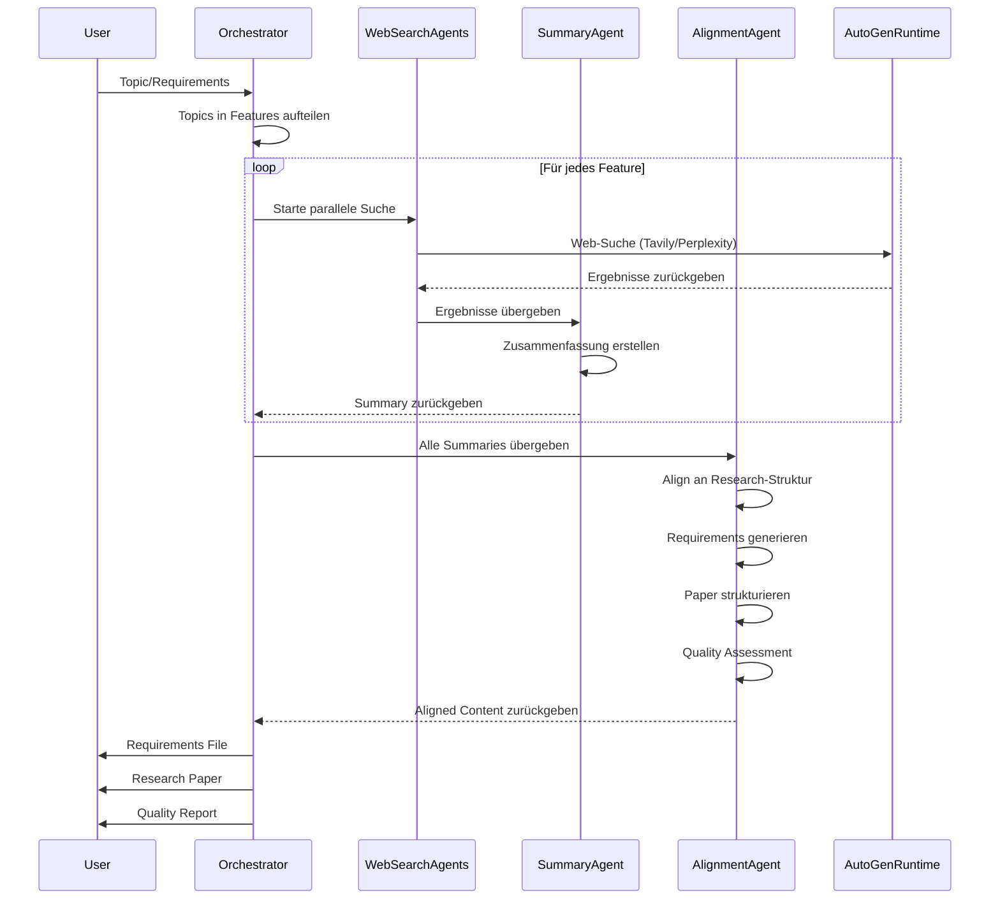
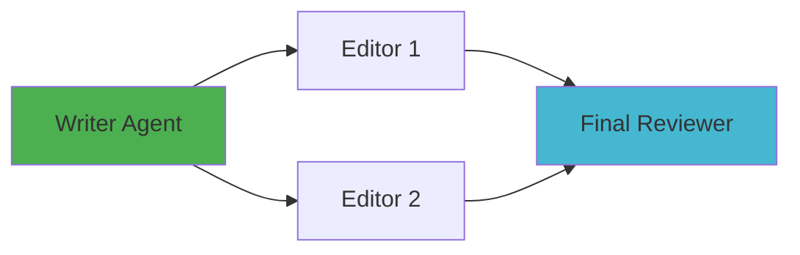

# AutoGen-basiertes Multi-Agenten-Research-System

## Übersicht

Dieses Dokument beschreibt die Architektur und Implementierung eines Multi-Agenten-Research-Systems basierend auf Microsoft AutoGen Framework.

## Architektur

### System-Übersicht



### Workflow-Diagramm



### Parallel Flow mit Fan-out



## Komponenten

### 1. AutoGen Runtime (GrpcWorkerAgentRuntimeHost)

Der Host Service verwaltet Worker Agent Connections und ermöglicht asynchrone Kommunikation.

**Verantwortlichkeiten:**
- Worker Agent Registrierung
- Message Routing
- Verbindung Management
- Fehlerbehandlung

### 2. Orchestrator Agent (AssistantAgent)

Koordiniert alle Worker Agents und verwaltet den Forschungsprozess.

**Verantwortlichkeiten:**
- Requirements in Features aufteilen
- Worker Agents starten (als Events)
- Ergebnisse sammeln
- Alignment Agent aufrufen

### 3. WebSearch Worker Agents (GrpcWorkerAgentRuntime)

Pro Feature ein Worker Agent, der im Internet sucht.

**Verantwortlichkeiten:**
- Web-Suche durchführen (Tavily/Perplexity)
- Ergebnisse filtern und bewerten
- Ergebnisse an Summary Agent senden

### 4. Summary Agent (AssistantAgent)

Fasst Suchergebnisse von Worker Agents zusammen.

**Verantwortlichkeiten:**
- Ergebnisse empfangen
- Zusammenfassung erstellen
- Key Points extrahieren
- Zusammenfassung an Alignment Agent senden

### 5. Alignment Agent (AssistantAgent)

Alignt alle Summaries an die Research-Struktur.

**Verantwortlichkeiten:**
- Alle Summaries empfangen
- Requirements-Dokument generieren
- Research Paper generieren
- Quality Assessment durchführen

## Installation

```bash
pip install "autogen-ext[grpc]"
```

## Konfiguration

```python
import os
from autogen_ext.models.openai import OpenAIChatCompletionClient

# AutoGen Konfiguration
config_list = [
    {
        "model": "gpt-4",  # oder claude-3.5-sonnet
        "api_key": os.environ.get("OPENROUTER_API_KEY"),
        "base_url": "https://openrouter.ai/api/v1",
    }
]
```

## API-Keys

Benötigte Umgebungsvariablen:

```bash
# OpenRouter API Key (für LLM)
export OPENROUTER_API_KEY=your_key_here

# Tavily API Key (für Web-Suche, optional)
export TAVILY_API_KEY=your_key_here
```

## Vorteile

1. **Weniger Coding-Aufwand**: AutoGen bietet fertige Komponenten
2. **Getestete Stabilität**: Microsoft Framework mit aktiver Entwicklung
3. **Built-in Event System**: Keine eigene Event-Implementierung nötig
4. **Graph Flow**: Strukturierte Agenten-Kommunikation
5. **Worker Pattern**: Parallele Ausführung mit Events
6. **Skalierbarkeit**: Einfach mehr Worker Agents hinzuzufügen
