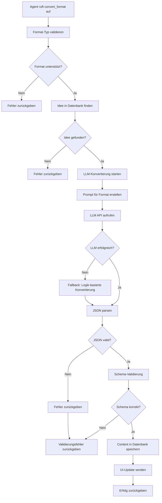

# Format-Validator Workflow

```mermaid
graph TD
    A[Agent ruft convert_format auf] --> B[Format-Typ validieren]
    B --> C{Format unterstützt?}
    C -->|Nein| D[Fehler zurückgeben]
    C -->|Ja| E[Idee in Datenbank finden]
    
    E --> F{Idee gefunden?}
    F -->|Nein| G[Fehler zurückgeben]
    F -->|Ja| H[LLM-Konvertierung starten]
    
    H --> I[Prompt für Format erstellen]
    I --> J[LLM API aufrufen]
    J --> K{LLM erfolgreich?}
    
    K -->|Nein| L[Fallback: Logik-basierte Konvertierung]
    K -->|Ja| M[JSON parsen]
    
    M --> N{JSON valid?}
    N -->|Nein| O[Fehler zurückgeben]
    N -->|Ja| P[Schema-Validierung]
    
    P --> Q{Schema korrekt?}
    Q -->|Nein| R[Validierungsfehler zurückgeben]
    Q -->|Ja| S[Content in Datenbank speichern]
    
    S --> T[UI-Update senden]
    T --> U[Erfolg zurückgeben]
    
    L --> M
    O --> R
```