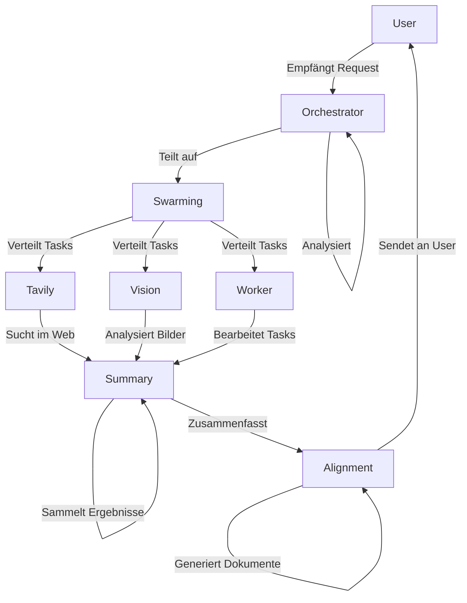
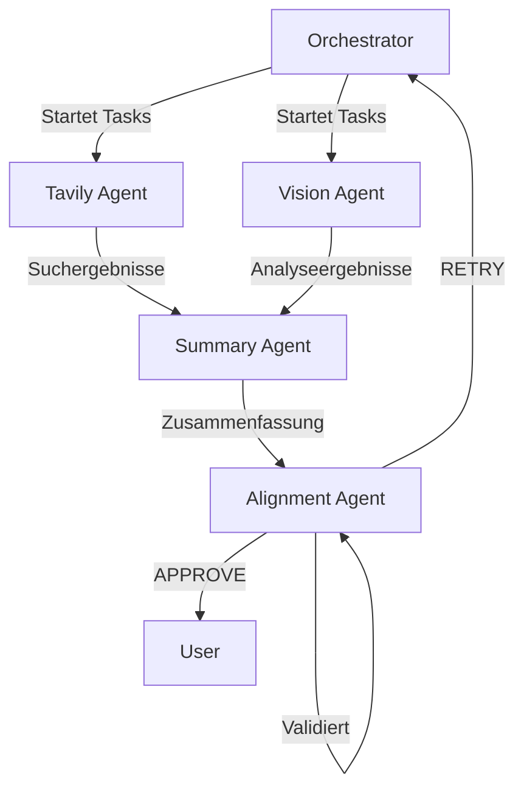

# Multi-Agenten-System Plan

## Übersicht

Dieses Dokument beschreibt den Plan für die Implementierung eines Multi-Agenten-Systems mit verschiedenen spezialisierten Agents, die orchestriert werden können.

## System-Architektur

Das System besteht aus folgenden Komponenten:

### 1. Tavily Agent (Web-Suche)
- **Zweck**: Echte Web-Suche mit Tavily MCP
- **Funktionen**:
  - Web-Suche mit Tavily Search API
  - Extraktion von Webseiten
  - Mapping von Website-Strukturen
  - Crawling von Websites
- **Status**: ✅ Implementiert (Test 11 abgeschlossen)

### 2. Vision Agent (Bildanalyse)
- **Zweck**: Analyse von Bildern und visuellen Daten
- **Funktionen**:
  - Bilderkennung und -klassifizierung
  - Objekterkennung und -tracking
  - Bildanalyse und -interpretation
- **Status**: ⏳ In Planung

### 3. Swarming Agent (Multi-Agenten-Koordination)
- **Zweck**: Koordination von mehreren Agents
- **Funktionen**:
  - Task-Verteilung an verschiedene Agents
  - Synchronisation von Agent-Aktivitäten
  - Load-Balancing zwischen Agents
  - Fehlerbehandlung und Recovery
- **Status**: ⏳ In Planung

### 4. Orchestrator Agent (System-Koordination)
- **Zweck**: Koordination des gesamten Workflows
- **Funktionen**:
  - Empfang von User-Requests
  - Aufteilung von Tasks in Sub-Tasks
  - Starten von Worker Agents
  - Sammeln von Ergebnissen
  - Weiterleitung an Alignment Agent
- **Status**: ✅ Implementiert (Test 4 abgeschlossen)

### 5. Summary Agent (Zusammenfassung)
- **Zweck**: Zusammenfassung von Suchergebnissen
- **Funktionen**:
  - Zusammenfassung von Web-Suche-Ergebnissen
  - Extraktion von Key Points
  - Strukturierung von Informationen
  - Weiterleitung an Alignment Agent
- **Status**: ✅ Implementiert (Test 5 abgeschlossen)

### 6. Alignment Agent (Qualitätssicherung)
- **Zweck**: Validierung und Ausrichtung aller Ergebnisse
- **Funktionen**:
  - Validierung von Suchergebnissen
  - Überprüfung von Quellen und Glaubwürdigkeit
  - Ausrichtung an die Research-Struktur
  - Generierung von Requirements-Dokument
  - Generierung von Research Paper
  - Generierung von Quality Report
- **Status**: ✅ Implementiert (Test 6 abgeschlossen)

## GraphFlow Workflow-Orchestrierung

### GraphFlow Konzepte

Das Multi-Agenten-System verwendet AutoGen GraphFlow für die Workflow-Orchestrierung:

#### 1. DiGraphBuilder
- **Zweck**: Erstellen von Workflow-Graphen
- **Funktionen**:
  - `add_node()`: Hinzufügen von Agent-Nodes
  - `add_edge()`: Hinzufügen von Kanten mit Bedingungen
  - `set_entry_point()`: Setzen des Einstiegspunkts
  - `build()`: Erstellen des Graphen

#### 2. GraphFlow
- **Zweck**: Ausführen von Workflow-Graphen
- **Funktionen**:
  - `run_stream()`: Ausführen des Workflows
  - `participants`: Liste der teilnehmenden Agents
  - `graph`: Der Workflow-Graph
  - `termination_condition`: Terminierungsbedingung

#### 3. MessageFilterAgent
- **Zweck**: Filtern von Nachrichten für spezifische Agents
- **Funktionen**:
  - `MessageFilterConfig`: Konfiguration von Nachrichtenfiltern
  - `PerSourceFilter`: Filtern von Nachrichten pro Quelle
  - `position`: Position der Nachrichten (first, last)
  - `count`: Anzahl der zu filternden Nachrichten

#### 4. Activation Conditions
- **Zweck**: Steuerung von Kanten-Ausführung
- **Funktionen**:
  - `condition`: Lambda-Funktion für Kanten-Bedingungen
  - `lambda msg: "APPROVE" in msg.to_model_text()`: Beispiel für eine Bedingung

### Workflow-Phasen

#### Phase 1: User-Request
1. User sendet eine Forschungsanfrage
2. Orchestrator empfängt die Anfrage
3. Orchestrator analysiert die Anforderungen
4. Orchestrator teilt die Anforderungen in Features auf
5. Orchestrator erstellt Sub-Tasks für jedes Feature

#### Phase 2: Parallel-Execution mit GraphFlow
6. Swarming Agent verteilt die Sub-Tasks an verschiedene Agent Teams
7. Tavily Agent führt Web-Suche durch
8. Vision Agent analysiert Bilder (falls vorhanden)
9. Worker Agents bearbeiten ihre zugewiesenen Tasks
10. Alle Agents arbeiten parallel mit GraphFlow

#### Phase 3: Zusammenfassung mit MessageFilter
11. Summary Agent sammelt alle Ergebnisse ein
12. MessageFilterAgent filtert relevante Nachrichten
13. Summary Agent erstellt strukturierte Zusammenfassung
14. Summary Agent extrahiert Key Points

#### Phase 4: Validierung und Ausrichtung
15. Alignment Agent validiert alle Ergebnisse
16. Alignment Agent überprüft Quellen und Glaubwürdigkeit
17. Alignment Agent generiert Requirements-Dokument
18. Alignment Agent generiert Research Paper
19. Alignment Agent generiert Quality Report

#### Phase 5: Rückgabe
20. Orchestrator sendet alle Ergebnisse an User zurück

### GraphFlow Beispiel

```python
from autogen_agentchat.agents import AssistantAgent, MessageFilterAgent, MessageFilterConfig, PerSourceFilter
from autogen_agentchat.teams import DiGraphBuilder, GraphFlow
from autogen_agentchat.conditions import MaxMessageTermination
from autogen_ext.models.openai import OpenAIChatCompletionClient

# Model Client
model_client = OpenAIChatCompletionClient(model="gpt-4o-mini")

# Agents
orchestrator = AssistantAgent(
    "orchestrator",
    model_client=model_client,
    system_message="Du bist der Orchestrator für ein Multi-Agenten-Research-System."
)

tavily_agent = AssistantAgent(
    "tavily_agent",
    model_client=model_client,
    tools=[tavily_search],
    system_message="Du bist der Tavily Agent für Web-Suche."
)

vision_agent = AssistantAgent(
    "vision_agent",
    model_client=model_client,
    tools=[analyze_image],
    system_message="Du bist der Vision Agent für Bildanalyse."
)

summary_core = AssistantAgent(
    "summary",
    model_client=model_client,
    system_message="Du bist der Summary Agent für Zusammenfassungen."
)

# Filtered summarizer
filtered_summary = MessageFilterAgent(
    name="summary",
    wrapped_agent=summary_core,
    filter=MessageFilterConfig(
        per_source=[
            PerSourceFilter(source="user", position="first", count=1),
            PerSourceFilter(source="tavily_agent", position="last", count=1),
            PerSourceFilter(source="vision_agent", position="last", count=1),
        ]
    ),
)

alignment_agent = AssistantAgent(
    "alignment",
    model_client=model_client,
    system_message="Du bist der Alignment Agent für Validierung und Ausrichtung."
)

# Build graph with conditional edges
builder = DiGraphBuilder()
builder.add_node(orchestrator)
builder.add_node(tavily_agent)
builder.add_node(vision_agent)
builder.add_node(filtered_summary)
builder.add_node(alignment_agent)

# Add edges with conditions
builder.add_edge(orchestrator, tavily_agent)
builder.add_edge(orchestrator, vision_agent)
builder.add_edge(tavily_agent, filtered_summary)
builder.add_edge(vision_agent, filtered_summary)
builder.add_edge(filtered_summary, alignment_agent)
builder.add_edge(alignment_agent, orchestrator, condition=lambda msg: "RETRY" in msg.to_model_text())

# Set entry point
builder.set_entry_point(orchestrator)

# Build graph
graph = builder.build()

# Termination condition
termination_condition = MaxMessageTermination(20)

# Create the flow
flow = GraphFlow(
    participants=builder.get_participants(),
    graph=graph,
    termination_condition=termination_condition
)

# Run the flow
result = await flow.run_stream(task="Forsche über Multi-Agenten-Systeme.")
```

## Implementierungs-Status

| Komponente | Status | Test |
|-------------|--------|------|
| Tavily Agent | ✅ Abgeschlossen | Test 11 |
| Vision Agent | ⏳ In Planung | - |
| Swarming Agent | ⏳ In Planung | - |
| Orchestrator Agent | ✅ Abgeschlossen | Test 4 |
| Summary Agent | ✅ Abgeschlossen | Test 5 |
| Alignment Agent | ✅ Abgeschlossen | Test 6 |
| GraphFlow Workflow | ⏳ In Planung | - |
| MessageFilterAgent | ⏳ In Planung | - |
| Integration mit VibeMind | ✅ Abgeschlossen | Test 15 |

## Nächste Schritte

1. **Vision Agent implementieren**
   - Bilderkennungs-Funktionen implementieren
   - Objekterkennungs-Funktionen implementieren
   - Bildanalyse-Funktionen implementieren

2. **Swarming Agent implementieren**
   - Task-Verteilungs-Logik implementieren
   - Synchronisations-Mechanismus implementieren
   - Load-Balancing implementieren
   - Fehlerbehandlung implementieren

3. **GraphFlow Workflow implementieren**
   - DiGraphBuilder für Workflow-Graph erstellen
   - Kanten mit Bedingungen hinzufügen
   - MessageFilterAgent für Nachrichtenfilterung implementieren
   - GraphFlow für Workflow-Ausführung implementieren

4. **Integration testen**
   - Alle Komponenten zusammen testen
   - End-to-End-Workflow validieren

5. **Dokumentation erstellen**
   - API-Dokumentation erstellen
   - Benutzerhandbuch erstellen
   - Entwickler-Guide erstellen

## Technologie-Stack

- **AutoGen 0.10.4**: Multi-Agenten-Framework
- **GraphFlow**: Workflow-Orchestrierung
- **MessageFilterAgent**: Nachrichtenfilterung
- **Tavily MCP**: Web-Suche API
- **FastAPI**: REST API Server
- **Strawberry GraphQL**: GraphQL API
- **VibeMind**: Client-Anwendung

## Architektur-Diagramm



## GraphFlow Workflow-Diagramm



## Offene Fragen

1. Welche Bilderkennungs-Funktionen sollen implementiert werden?
2. Welche Objekterkennungs-Funktionen sollen implementiert werden?
3. Welche Bildanalyse-Funktionen sollen implementiert werden?
4. Welche Task-Verteilungs-Strategien sollen verwendet werden?
5. Welche Synchronisations-Mechanismen sollen implementiert werden?
6. Welche Load-Balancing-Strategien sollen verwendet werden?
7. Welche Fehlerbehandlungs-Strategien sollen implementiert werden?
8. Welche MessageFilter-Konfigurationen sollen verwendet werden?
9. Welche Activation Conditions sollen implementiert werden?

## Zeitplan

- **Vision Agent**: 2-3 Tage
- **Swarming Agent**: 3-5 Tage
- **GraphFlow Workflow**: 2-3 Tage
- **Integration und Testing**: 1-2 Tage
- **Dokumentation**: 1-2 Tage

**Gesamt**: 8-13 Tage
