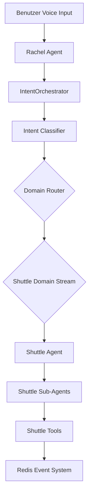
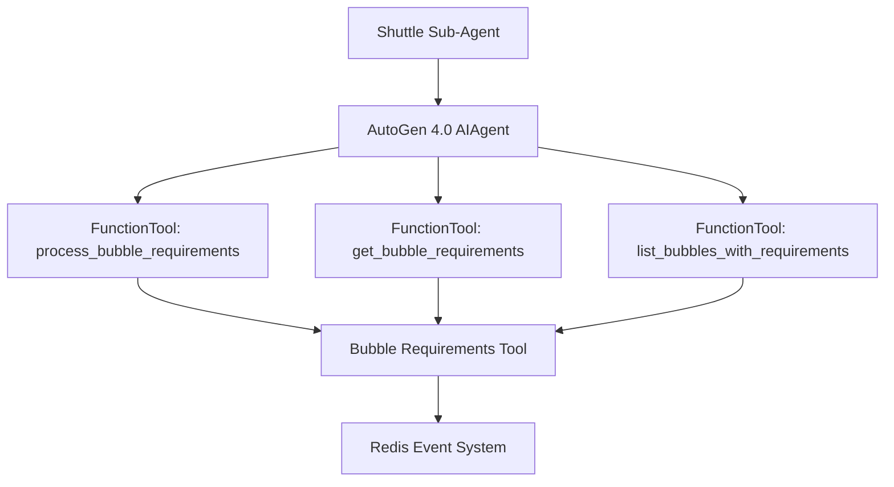
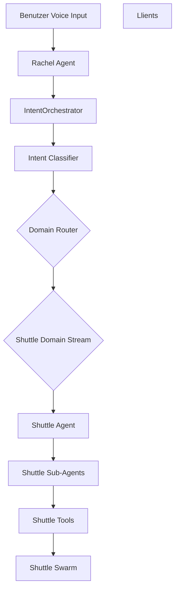

# Shuttle Agent Architektur-Plan (AutoGen 4.0) - Final

## Zusammenfassung

Dieser Plan beschreibt die Architektur und Implementierung eines neuen Shuttle-Agent für das VibeMind-VoiceDialog Projekt. Der Shuttle-Agent ist ein 1-zu-1 funktionales Äquivalent zum bestehenden Bubble Requirements Tool, aber mit einer anderen Benutzeroberfläche (AutoGen 4.0-basiert statt direkter Tool-Aufruf).

**Wichtig:** Die Shuttle-Tools sind Agents, die Shuttle-Tools verwenden. Das bedeutet, dass die Shuttle-Sub-Agents AutoGen 4.0 Agents sind, die die bestehenden Shuttle-Tools (bubble_requirements_tool.py) aufrufen.

## Architektur-Übersicht

## 1. Analyse der bestehenden Sub-Agents

### 1.1 BaseBackendAgent (python/swarm/backend_agents/base_agent.py)

**Gemeinsame Funktionalität:**
- Redis Stream Subscription
- Tool Loading und Mapping
- Status Publishing
- Error Handling
- Parameter Normalisierung
- Kontext-Referenz-Auflösung

**Schlüssel-Methoden:**
- `stream()`: Der Redis Stream, auf den der Agent hört
- `name()`: Agent-Name für Logging
- `bus()`: EventBus für Event-Publishing
- `tools()`: Lazy-Loading der Tools
- `_load_tools()`: Abstrakte Methode für Tool-Loading
- `_get_tool_name()`: Mapping von Event-Type zu Tool-Name
- `_normalize_params()`: Normalisierung der Parameter-Namen
- `_resolve_context_references()`: Auflösung von Kontext-Referenzen
- `_handle_event()`: Haupt-Event-Handler
- `_publish_status()`: Status-Updates publishen
- `_publish_error()`: Fehler-Updates publishen
- `_ask_question()`: Fragen an Rachel stellen
- `setup_consumer_group()`: Redis Consumer Group erstellen
- `read_with_consumer_group()`: Events mit Consumer Group lesen
- `ack_message()`: Nachrichten bestätigen
- `get_pending_messages()`: Ausstehende Nachrichten abrufen

### 1.2 IdeasAgent (python/swarm/backend_agents/ideas_agent.py)

**Spezialisierung:**
- 38+ Tools für Ideen-Management
- EVENT_TO_TOOL Mapping für alle Event-Types
- PARAM_MAPPING für Parameter-Normalisierung
- AutoGen 4.0 Swarm Integration (USE_AG2_SWARM=true)

**Schlüssel-Tools:**
- Core Idea Tools: list_ideas, create_idea, find_idea, update_idea, delete_idea, move_idea, connect_ideas, disconnect_ideas, add_image, get_current_space, auto_link_ideas, format_idea_as_table, summarize_idea, generate_white_paper, expand_ideas, analyze_and_suggest_links, explain_idea
- Format Dispatcher Tools: convert_format, list_available_formats
- Exploration Tools: start_exploration, stop_exploration, get_exploration_status, accept_connection, reject_connection, explore_deeper, visualize_exploration, respond_to_exploration_question, set_exploration_direction

**AutoGen 4.0 Swarm Integration:**
- `_build_swarm_task()`: Baut Natural-Language-Task aus Event-Type + Payload
- `_run_swarm()`: Führt Task durch Ideas Swarm aus
- Handoff zu Ideas Swarm nach Abschluss

### 1.3 CodingAgent (python/swarm/backend_agents/coding_agent.py)

**Spezialisierung:**
- 8 Tools für Code-Generierung
- EVENT_TO_TOOL Mapping für Code-Events
- PARAM_MAPPING für Parameter-Normalisierung

**Schlüssel-Tools:**
- Code Generation Tools: generate_code, get_generation_status, cancel_generation, list_generated_projects
- Preview Tools: start_preview, stop_preview
- Voice Coding Tools: idea_to_project_sync, modify_code_sync

**AutoGen 4.0 Swarm Integration:**
- `_build_swarm_task()`: Baut Natural-Language-Task
- `_run_swarm()`: Führt Task durch Coding Swarm aus

### 1.4 DesktopAgent (python/swarm/backend_agents/desktop_agent.py)

**Spezialisierung:**
- 12 Tools für Desktop-Automatisierung
- EVENT_TO_TOOL Mapping für Desktop-Events
- PARAM_MAPPING für Parameter-Normalisierung

**Schlüssel-Tools:**
- Basic Desktop Tools: open_app, click_element, type_text, press_key, take_screenshot, scroll_screen
- Task Management Tools: create_task_node, update_task_status, get_task_list
- Moire Vision Tools: moire_scan, moire_find_element

**AutoGen 4.0 Swarm Integration:**
- `_build_swarm_task()`: Baut Natural-Language-Task
- `_run_swarm()`: Führt Task durch Desktop Swarm aus

## 2. Analyse der Domain-Specific Intent Tools

### 2.1 Domain Intent Tools (python/tools/domain_intent_tools.py)

**Spezialisierung:**
- 5 separate Tools für Domain-Routing
- Jedes Tool leitet Intents an eine spezifische Domain

**Domain-Specific Tools:**
1. **send_ideas_intent**: Ideen/Notizen-Management
2. **send_bubbles_intent**: Space/Bubble-Navigation
3. **send_desktop_intent**: Desktop-Automatisierung
4. **send_coding_intent**: Code-Generierung
5. **send_shuttles_intent**: Requirements-Pipeline

**Tool-Definitionen:**
- Jedes Tool hat eine Beschreibung, Parameter und Keywords
- SHUTTLES_TOOL_DEFINITION bereits definiert

**Integration in Rachel's Tools:**
- Alle 5 Domain-Tools sind bereits in Rachel's Tools registriert
- SHUTTLES_TOOL_DEFINITION ist bereits importiert

## 3. Analyse der bestehenden Shuttle-Tools

### 3.1 Bubble Requirements Tool (python/tools/bubble_requirements_tool.py)

**Spezialisierung:**
- Asynchrone Funktionen für Bubble-Inhalts-Verarbeitung
- LLM-basierte Requirements-Generierung
- Metadata-Extraktion aus Bubble-Nodes

**Schlüssel-Funktionen:**
- `process_bubble_requirements(bubble_id)`: Verarbeitet Bubble-Inhalte und generiert Requirements
- `get_bubble_requirements(bubble_id)`: Holt Requirements für eine spezifische Bubble
- `list_bubbles_with_requirements()`: Listet alle Bubbles mit Requirements

**Integration in IntentOrchestrator:**
- Shuttle-Tools sind bereits zu den Tool-Executoren hinzugefügt
- 3 Tools: shuttle.list, shuttle.get, shuttle.process

## 4. AutoGen 4.0 Architektur-Patterns

### 4.1 AIAgent Pattern

**Komponenten:**
- **AIAgent**: Haupt-Agent-Klasse mit System-Message, Model-Client, Tools und Delegate-Tools
- **FunctionTool**: Tool-Definition für direkte Ausführung
- **Handoffs**: Liste von Agenten, an die delegiert werden kann
- **TopicId**: Topic-basierte Kommunikation
- **TypeSubscription**: Subscription auf spezifische Topics

**Handoff-Mechanismus:**
- Agent kann explizit an einen anderen Agent delegieren
- Handoff wird durch FunctionTool ausgelöst
- Ziel-Agent empfängt Task über Topic-Subscription

### 4.2 Multi-Agenten-System mit Topic-basierter Kommunikation

**Architektur:**
- **SingleThreadedAgentRuntime**: Zentraler Runtime für alle Agents
- **Topic-basierte Kommunikation**: Jeder Agent hat einen eigenen Topic
- **TypeSubscription**: Agents subscriben nur auf ihren eigenen Topic
- **Handoff-FunctionTools**: Tools für explizite Delegation

**Vorteile:**
- Isolierte Domänen mit eigener Kommunikation
- Skalierbar durch Hinzufügen weiterer Agents
- Keine zentrale Koordination nötig

## 5. Shuttle-Agent Architektur-Design

### 5.1 ShuttleAgent (python/swarm/backend_agents/shuttle_agent.py)

**Spezialisierung:**
- Erbt von BaseBackendAgent
- Implementiert Shuttle-spezifische Funktionalität
- Nutzt AutoGen 4.0 für Multi-Agenten-System

**Schlüssel-Eigenschaften:**
- `stream`: EventBus.STREAM_TASKS_SHUTTLES (neuer Stream)
- `name`: "ShuttleAgent"
- EVENT_TO_TOOL Mapping für Shuttle-Events
- PARAM_MAPPING für Parameter-Normalisierung

**Shuttle-spezifische Tools:**
1. **shuttle.list**: Liste aller Bubbles mit Requirements
2. **shuttle.get**: Requirements für eine spezifische Bubble
3. **shuttle.process**: Bubble-Inhalte verarbeiten und Requirements generieren

### 5.2 Shuttle Sub-Agents (python/swarm/sub_agents/shuttle_sub_agents.py)

**Spezialisierung:**
- **Wichtig:** Die Shuttle-Sub-Agents sind AutoGen 4.0 Agents, die die bestehenden Shuttle-Tools verwenden
- Ähnlich wie Ideas/Coding/Desktop Sub-Agents
- Nutzen AutoGen 4.0 für spezialisierte Aufgaben

**Sub-Agent-Typen:**
1. **shuttle_requirements_analyst**: AutoGen 4.0 Agent, der die Shuttle-Tools für Requirements-Analyse und Validierung verwendet
2. **shuttle_pipeline_manager**: AutoGen 4.0 Agent, der die Shuttle-Tools für Pipeline-Management und Stufen-Koordination verwendet
3. **shuttle_exporter**: AutoGen 4.0 Agent, der die Shuttle-Tools für Export in verschiedene Formate verwendet
4. **shuttle_validator**: AutoGen 4.0 Agent, der die Shuttle-Tools für Requirements-Validierung gegen Spezifikationen verwendet

**Architektur-Diagramm:**

## 6. Redis Event System Integration

### 6.1 Stream-Definition

**Neuer Stream:**
- `EventBus.STREAM_TASKS_SHUTTLES`: "tasks:shuttles"

**Stream-Charakteristika:**
- Isolierte Domain für Shuttle-Events
- Verhindert Konflikte mit anderen Domänen
- Ermöglicht parallele Verarbeitung

### 6.2 IntentOrchestrator Integration

**Domain-Specific Routing:**
- Erweiterung des IntentOrchestrator für Shuttle-Domain
- Hinzufügen von "shuttles" zu den Domain-Hints

**Integration-Punkte:**
1. **domain_hint="shuttles"**: Parameter in process_intent()
2. **_route_to_domain()**: Methode für Domain-Routing
3. **Tool-Executors**: Hinzufügen der Shuttle-Tools

## 7. Implementierungs-Schritte

### 7.1 Shuttle-Agent Backend erstellen

**Datei:** `python/swarm/backend_agents/shuttle_agent.py`

**Schritte:**
1. ShuttleAgent-Klasse erstellen mit BaseBackendAgent als Basisklasse
2. EVENT_TO_TOOL Mapping definieren für Shuttle-Events
3. PARAM_MAPPING definieren für Parameter-Normalisierung
4. _load_tools() implementieren für Shuttle-Tools
5. _get_tool_name() implementieren für Event-Type zu Tool-Name Mapping
6. _handle_event() implementieren für Shuttle-Event-Handling
7. AutoGen 4.0 Swarm Integration implementieren (optional)

### 7.2 Shuttle Sub-Agents erstellen

**Datei:** `python/swarm/sub_agents/shuttle_sub_agents.py`

**Schritte:**
1. create_shuttle_requirements_analyst() erstellen - AutoGen 4.0 Agent, der die Shuttle-Tools verwendet
2. create_shuttle_pipeline_manager() erstellen - AutoGen 4.0 Agent, der die Shuttle-Tools verwendet
3. create_shuttle_exporter() erstellen - AutoGen 4.0 Agent, der die Shuttle-Tools verwendet
4. create_shuttle_validator() erstellen - AutoGen 4.0 Agent, der die Shuttle-Tools verwendet

**Wichtig:** Jeder Sub-Agent ist ein AutoGen 4.0 AIAgent, der die bestehenden Shuttle-Tools (bubble_requirements_tool.py) als FunctionTools verwendet.

### 7.3 EventBus erweitern

**Datei:** `python/swarm/event_bus.py`

**Schritte:**
1. STREAM_TASKS_SHUTTLES Konstante hinzufügen
2. STREAM_STATUS_SHUTTLES Konstante hinzufügen

### 7.4 IntentOrchestrator erweitern

**Datei:** `python/swarm/orchestrator/intent_orchestrator.py`

**Schritte:**
1. domain_hint="shuttles" zu den Domain-Hints hinzufügen
2. _route_to_domain() für Shuttle-Domain erweitern
3. Shuttle-Tools zu den Tool-Executoren hinzufügen

### 7.5 Rachel's Tools erweitern

**Datei:** `python/tools/domain_intent_tools.py`

**Schritte:**
1. SHUTTLES_TOOL_DEFINITION ist bereits definiert
2. send_shuttles_intent_from_dict ist bereits implementiert

### 7.6 AutoGen 4.0 Swarm Integration erstellen

**Datei:** `python/swarm/backend_agents/shuttle_swarm.py`

**Schritte:**
1. Shuttle Swarm erstellen (ähnlich wie Ideas/Coding/Desktop Swarm)
2. Shuttle-Agent mit Swarm integrieren

### 7.7 Test und Validierung

**Schritte:**
1. Unit-Tests für Shuttle-Agent erstellen
2. Integration-Tests erstellen
3. End-to-End-Tests durchführen

## 8. Architektur-Diagramm

## 9. Technische Spezifikationen

### 9.1 AutoGen 4.0 Version

**Empfohlene Version:** python-v0.7_4

**Schlüssel-Features:**
- AIAgent mit Handoffs
- Topic-basierte Kommunikation
- TypeSubscription
- SingleThreadedAgentRuntime

### 9.2 Redis Konfiguration

**Stream-Präfix:** "tasks:shuttles"

**Consumer Group:** "shuttle_consumers"

**Event-Types:**
- shuttle.list
- shuttle.get
- shuttle.process

### 9.3 System-Komponenten

**Komponenten:**
1. **ShuttleAgent**: Haupt-Backend-Agent
2. **Shuttle Sub-Agents**: 4 spezialisierte AutoGen 4.0 Agents, die die Shuttle-Tools verwenden
3. **Shuttle Swarm**: AutoGen 4.0 Swarm für Shuttle-Domain
4. **EventBus**: Erweitert mit Shuttle-Streams
5. **IntentOrchestrator**: Erweitert mit Shuttle-Domain-Routing
6. **Rachel's Tools**: Erweitert mit Shuttle-Tools

## 10. Nächste Schritte

1. Architektur-Plan vom Benutzer genehmigen lassen
2. Implementierung der Shuttle-Agent Komponenten
3. Integration in das Redis Event System
4. Integration in den IntentOrchestrator
5. Test und Validierung
