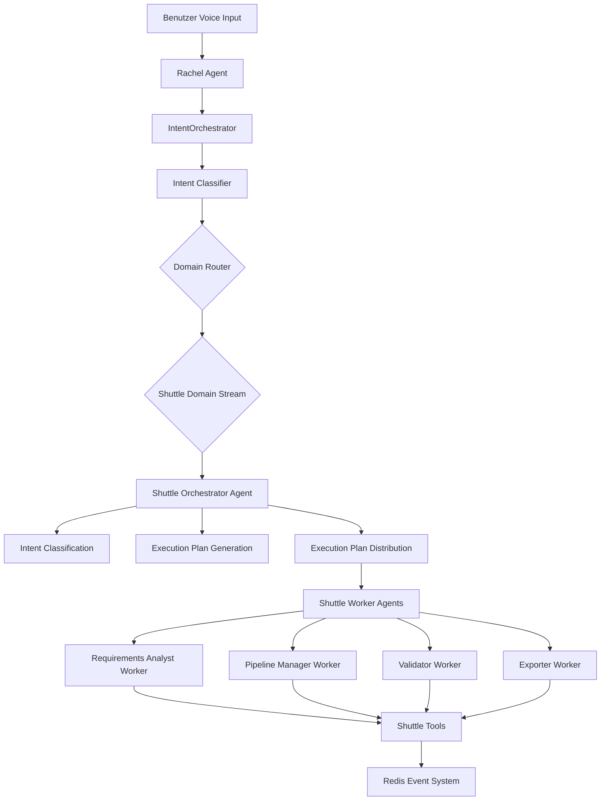
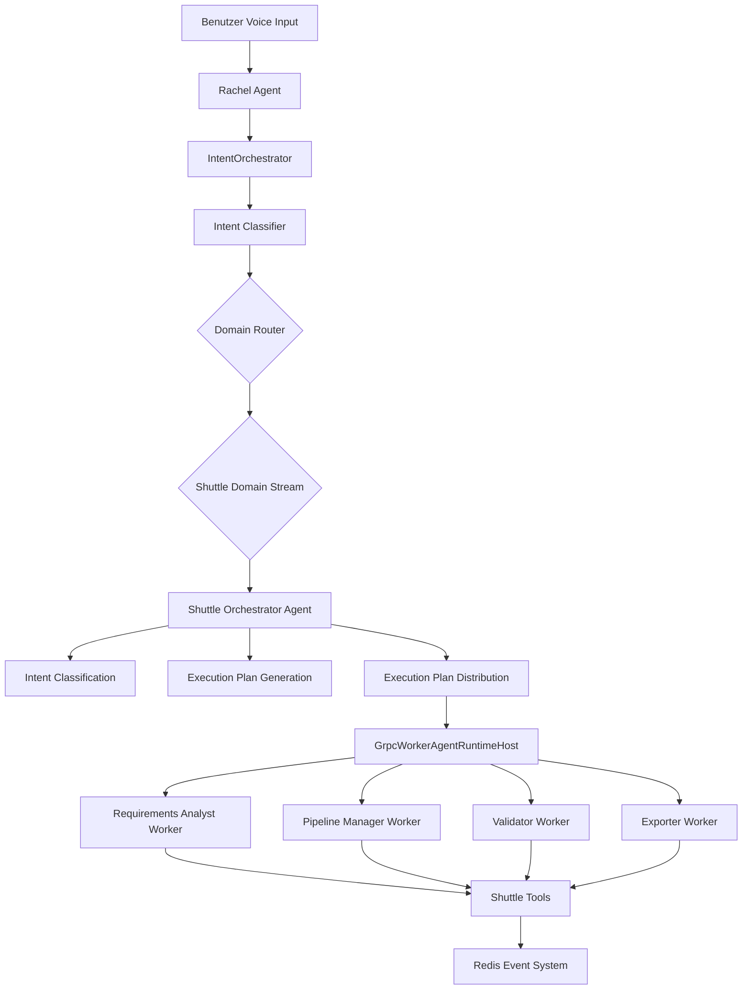

# Distributed Shuttle Agent Architektur-Plan (AutoGen 4.0 + gRPC)

## Zusammenfassung

Dieser Plan beschreibt die Architektur und Implementierung eines distributed Shuttle Agent Systems für das VibeMind-VoiceDialog Projekt. Das System nutzt AutoGen 4.0 für Multi-Agenten-Koordination und gRPC für distributed Kommunikation über Prozessgrenzen hinweg.

**Wichtige Anforderungen:**
1. Shuttle tool agents sollen als gRPC worker agents mit GrpcWorkerAgentRuntime deployed werden
2. Das System muss einen GrpcWorkerAgentRuntimeHost verwenden, um die Kommunikation und das Agent Lifecycle Management über Prozessgrenzen hinweg zu ermöglichen
3. Ein Subagent muss als Orchestrator fungieren, der für das Workflow-Management verantwortlich ist
4. Der Orchestrator muss sicherstellen, dass Intent Classification, Execution Plan Generation und Execution Plan Distribution in der korrekten Reihenfolge erfolgen
5. Die Implementierung sollte den bereitgestellten Code-Patterns folgen:
   - Starten des Host Service
   - Definieren von RoutedAgent Klassen mit Message Handlern
   - Registrieren von Agents mit Worker Runtimes
   - Der Orchestrator muss effektiv Tasks an die entsprechenden Workers verteilen

## Architektur-Übersicht

## 1. Analyse der bestehenden Architektur

### 1.1 BaseBackendAgent (python/swarm/backend_agents/base_agent.py)

**Gemeinsame Funktionalität:**
- Redis Stream Subscription
- Tool Loading und Mapping
- Status Publishing
- Error Handling
- Parameter Normalisierung
- Kontext-Referenz-Auflösung

**Schlüssel-Methoden:**
- `stream()`: Der Redis Stream, auf den der Agent hört
- `name()`: Agent-Name für Logging
- `bus()`: EventBus für Event-Publishing
- `tools()`: Lazy-Loading der Tools
- `_load_tools()`: Abstrakte Methode für Tool-Loading
- `_get_tool_name()`: Mapping von Event-Type zu Tool-Name
- `_normalize_params()`: Normalisierung der Parameter-Namen
- `_resolve_context_references()`: Auflösung von Kontext-Referenzen
- `_handle_event()`: Haupt-Event-Handler
- `_publish_status()`: Status-Updates publishen
- `_publish_error()`: Fehler-Updates publishen
- `_ask_question()`: Fragen an Rachel stellen
- `setup_consumer_group()`: Redis Consumer Group erstellen
- `read_with_consumer_group()`: Events mit Consumer Group lesen
- `ack_message()`: Nachrichten bestätigen
- `get_pending_messages()`: Ausstehende Nachrichten abrufen

### 1.2 IdeasAgent (python/swarm/backend_agents/ideas_agent.py)

**Spezialisierung:**
- 38+ Tools für Ideen-Management
- EVENT_TO_TOOL Mapping für alle Event-Types
- PARAM_MAPPING für Parameter-Normalisierung
- AutoGen 4.0 Swarm Integration (USE_AG2_SWARM=true)

**Schlüssel-Tools:**
- Core Idea Tools: list_ideas, create_idea, find_idea, update_idea, delete_idea, move_idea, connect_ideas, disconnect_ideas, add_image, get_current_space, auto_link_ideas, format_idea_as_table, summarize_idea, generate_white_paper, expand_ideas, analyze_and_suggest_links, explain_idea
- Format Dispatcher Tools: convert_format, list_available_formats
- Exploration Tools: start_exploration, stop_exploration, get_exploration_status, accept_connection, reject_connection, explore_deeper, visualize_exploration, respond_to_exploration_question, set_exploration_direction

**AutoGen 4.0 Swarm Integration:**
- `_build_swarm_task()`: Baut Natural-Language-Task aus Event-Type + Payload
- `_run_swarm()`: Führt Task durch Ideas Swarm aus
- Handoff zu Ideas Swarm nach Abschluss

### 1.3 Sub-Agents (python/swarm/sub_agents/base_sub_agent.py)

**Spezialisierung:**
- Memory Sub-Agent: User profiling aus Domain-Perspektive
- Context Sub-Agent: Running transcript summary für AI restart

**Schlüssel-Funktionen:**
- `create_memory_sub_agent()`: Erstellt Memory Sub-Agent für User profiling
- `create_context_sub_agent()`: Erstellt Context Sub-Agent für Session context

## 2. Distributed gRPC Architektur-Design

### 2.1 GrpcWorkerAgentRuntime

**Komponenten:**
- **GrpcWorkerAgentRuntime**: Runtime für gRPC Worker Agents
- **GrpcWorkerAgentRuntimeHost**: Host für Kommunikation und Lifecycle Management
- **RoutedAgent**: Agent-Klasse mit Message Handlern

**Vorteile:**
- Isolierte Prozesse für jeden Worker
- Skalierbar durch Hinzufügen weiterer Workers
- Keine zentrale Koordination nötig
- Bessere Fehlerisolierung

### 2.2 Shuttle Orchestrator Agent

**Spezialisierung:**
- AutoGen 4.0 AIAgent mit Handoffs
- Verantwortlich für Workflow-Management
- Koordiniert Intent Classification, Execution Plan Generation und Distribution

**Schritt-Workflow:**
1. **Intent Classification**: Analysiert den User-Intent
2. **Execution Plan Generation**: Erstellt einen Ausführungsplan
3. **Execution Plan Distribution**: Verteilt Tasks an die entsprechenden Workers

### 2.3 Shuttle Worker Agents

**Worker-Typen:**
1. **Requirements Analyst Worker**: Analysiert und validiert Requirements
2. **Pipeline Manager Worker**: Verwaltet Pipeline-Stufen
3. **Validator Worker**: Validiert Requirements gegen Spezifikationen
4. **Exporter Worker**: Exportiert in verschiedene Formate

**Worker-Eigenschaften:**
- Jeder Worker ist ein gRPC Worker Agent mit GrpcWorkerAgentRuntime
- Jeder Worker hat Zugriff auf die Shuttle-Tools
- Workers sind unabhängig und können parallel ausgeführt werden

## 3. Implementierungs-Schritte

### 3.1 GrpcWorkerAgentRuntime erstellen

**Datei:** `python/swarm/grpc_worker_runtime.py`

**Schritte:**
1. GrpcWorkerAgentRuntime-Klasse erstellen
2. GrpcWorkerAgentRuntimeHost-Klasse erstellen
3. RoutedAgent-Basisklasse erstellen
4. Message Handler Pattern implementieren
5. gRPC Server und Client erstellen

### 3.2 Shuttle Orchestrator Agent erstellen

**Datei:** `python/swarm/backend_agents/shuttle_orchestrator_agent.py`

**Schritte:**
1. ShuttleOrchestratorAgent-Klasse erstellen mit BaseBackendAgent als Basisklasse
2. EVENT_TO_TOOL Mapping definieren für Shuttle-Events
3. PARAM_MAPPING definieren für Parameter-Normalisierung
4. _load_tools() implementieren für Shuttle-Tools
5. _get_tool_name() implementieren für Event-Type zu Tool-Name Mapping
6. _handle_event() implementieren für Shuttle-Event-Handling
7. AutoGen 4.0 Swarm Integration implementieren

### 3.3 Shuttle Worker Agents erstellen

**Datei:** `python/swarm/grpc_workers/shuttle_workers.py`

**Schritte:**
1. RequirementsAnalystWorker erstellen
2. PipelineManagerWorker erstellen
3. ValidatorWorker erstellen
4. ExporterWorker erstellen
5. Jeden Worker mit GrpcWorkerAgentRuntime registrieren

### 3.4 EventBus erweitern

**Datei:** `python/swarm/event_bus.py`

**Schritte:**
1. STREAM_TASKS_SHUTTLES Konstante hinzufügen
2. STREAM_STATUS_SHUTTLES Konstante hinzufügen
3. gRPC Stream Konstanten hinzufügen

### 3.5 IntentOrchestrator erweitern

**Datei:** `python/swarm/orchestrator/intent_orchestrator.py`

**Schritte:**
1. domain_hint="shuttles" zu den Domain-Hints hinzufügen
2. _route_to_domain() für Shuttle-Domain erweitern
3. Shuttle-Tools zu den Tool-Executoren hinzufügen

### 3.6 Rachel's Tools erweitern

**Datei:** `python/tools/domain_intent_tools.py`

**Schritte:**
1. SHUTTLES_TOOL_DEFINITION ist bereits definiert
2. send_shuttles_intent_from_dict ist bereits implementiert

### 3.7 gRPC Host Service erstellen

**Datei:** `python/swarm/grpc_host_service.py`

**Schritte:**
1. GrpcWorkerAgentRuntimeHost erstellen
2. Shuttle Orchestrator Agent registrieren
3. Shuttle Worker Agents registrieren
4. gRPC Server starten

### 3.8 Test und Validierung

**Schritte:**
1. Unit-Tests für Shuttle Orchestrator Agent erstellen
2. Unit-Tests für Shuttle Worker Agents erstellen
3. Integration-Tests erstellen
4. End-to-End-Tests durchführen

## 4. Architektur-Diagramm

## 5. Technische Spezifikationen

### 5.1 AutoGen 4.0 Version

**Empfohlene Version:** python-v0.7_4

**Schlüssel-Features:**
- AIAgent mit Handoffs
- Topic-basierte Kommunikation
- TypeSubscription
- SingleThreadedAgentRuntime

### 5.2 gRPC Konfiguration

**Stream-Präfix:** "tasks:shuttles"

**Consumer Group:** "shuttle_consumers"

**Event-Types:**
- shuttle.list
- shuttle.get
- shuttle.process

### 5.3 System-Komponenten

**Komponenten:**
1. **ShuttleOrchestratorAgent**: Haupt-Backend-Agent
2. **Shuttle Worker Agents**: 4 spezialisierte gRPC Worker Agents
3. **GrpcWorkerAgentRuntimeHost**: Host für Kommunikation und Lifecycle Management
4. **EventBus**: Erweitert mit Shuttle-Streams
5. **IntentOrchestrator**: Erweitert mit Shuttle-Domain-Routing
6. **Rachel's Tools**: Erweitert mit Shuttle-Tools

## 6. Nächste Schritte

1. Architektur-Plan vom Benutzer genehmigen lassen
2. Implementierung der Shuttle-Agent Komponenten
3. Integration in das gRPC System
4. Integration in den IntentOrchestrator
5. Test und Validierung
