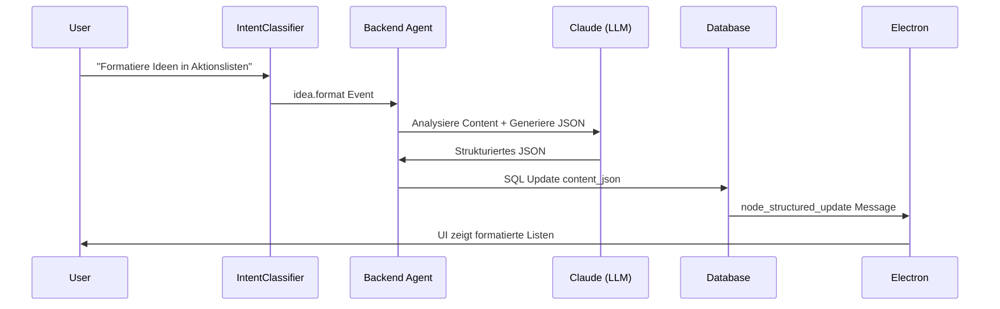

# Enhanced Structured Idea Formatting - Detaillierter Implementierungsplan

## Problemstellung (aus Logs bestätigt)
Das System crasht bei Anfragen wie "formatiere die Ideen in Aktionslisten und erstelle eine Tabelle mit technischen Details", weil:
- Ideen werden als einfacher Text gespeichert
- Keine JSON-Schema-Unterstützung für strukturierte Formate
- LLM kann keine SQL-Updates für strukturierte Inhalte durchführen
- Electron erhält keine entsprechenden Updates für komplexe Manipulationen

## Architektur-Entscheidung
**JSON-Schema in Datenbank definieren** + **LLM-driven SQL Tools** für Updates

### Warum diese Architektur?
- Skalierbar: Verschiedene Formate (Listen, Tabellen, Hierarchien)
- Konsistent: Schema-Validierung verhindert invalide Daten
- Erweiterbar: Neue Formate durch Schema-Definition
- LLM-Integration: Natürliche Sprache → strukturierte Daten

## Implementierungsschritte

### 1. Datenbank-Schema Definition
```sql
-- Neue Spalten für strukturierte Ideen
ALTER TABLE ideas ADD COLUMN format_schema JSON;
ALTER TABLE ideas ADD COLUMN content_json JSON;
ALTER TABLE ideas ADD COLUMN last_formatted TIMESTAMP;
```

### 2. JSON-Schema Definitionen
```json
{
  "action_list": {
    "type": "object",
    "properties": {
      "type": {"const": "action_list"},
      "items": {
        "type": "array",
        "items": {
          "type": "object",
          "properties": {
            "task": {"type": "string"},
            "status": {"enum": ["pending", "in_progress", "completed"]},
            "priority": {"enum": ["low", "medium", "high"]},
            "assignee": {"type": "string"}
          }
        }
      }
    }
  }
}
```

### 3. LLM-basierte Formatierungs-Tools
- `format_idea_content()`: Haupt-Tool für alle Formatierungen
- `validate_format_schema()`: Schema-Validierung
- `merge_structured_content()`: Zusammenführen von Änderungen

### 4. SQL-Tool Integration
```python
# Tool für LLM: update_idea_structured_content
def update_idea_structured_content(idea_id: str, new_content_json: dict, format_type: str):
    # Validierung gegen Schema
    # SQL Update der content_json Spalte
    # Broadcast an Electron
```

### 5. Intent Classifier Erweiterung
Neue Event-Types:
- `idea.format`: "Formatiere die Ideen in Aktionslisten"
- `idea.structure`: "Erstelle Tabelle mit Vorteilen/Nachteilen"
- `idea.organize`: "Organisiere hierarchisch"

### 6. Electron Rendering Engine
- Neue Message-Types: `node_structured_update`
- Rich-Content Renderer für:
  - Tabellen (HTML Tables)
  - Listen (Ordered/Unordered)
  - Hierarchische Strukturen (Trees)
  - Status-Indikatoren (Badges, Progress Bars)

## Workflow-Details



## Kritische Erfolgsfaktoren
1. **Schema-First**: Alle Formate müssen vorab definiert werden
2. **LLM Validation**: Output muss Schema-konform sein
3. **Backward Compatibility**: Bestehende Text-Ideen bleiben funktionsfähig
4. **Performance**: JSON-Queries müssen effizient sein
5. **UI Responsiveness**: Echtzeit-Updates ohne Verzögerung

## Testing-Strategie
- Unit Tests für Schema-Validierung
- Integration Tests für LLM → SQL → Electron
- E2E Tests mit Voice-Input → Formatierte Ausgabe
- Performance Tests für große Idea-Sets
