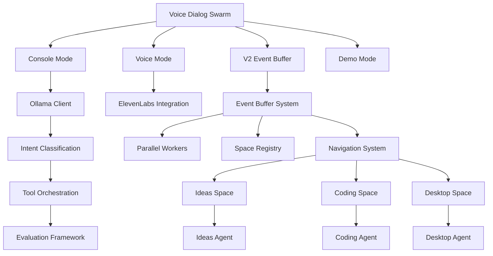

# VibeMind Swarm Architektur Testplan

## Übersicht
Dieser Testplan deckt alle kritischen Komponenten der Swarm-Architektur ab, um eine gründliche Validierung vor dem Produktiveinsatz sicherzustellen.

## Architektur-Komponenten

## Testphasen

### Phase 1: Grundlegende Konnektivität
- Ollama-Verbindung prüfen
- Modelle laden und validieren
- Basis-Kommunikation testen

### Phase 2: Einzelkomponenten
- Console-Modus mit grundlegenden Befehlen
- Intent-Klassifikation evaluieren
- Tool-Ausführung in allen Spaces
- Agent-Transfers testen

### Phase 3: Event Buffer System
- V2-Modus mit Navigation
- Parallelverarbeitung validieren
- Event-Queue Management
- Fehlerbehandlung

### Phase 4: Integrationstests
- Vollständige Integration mit Electron
- Multi-User Szenarien
- Performance-Metriken
- Edge Cases und Fehlerbehandlung

### Phase 5: Lasttests
- Hohe Auslastung simulieren
- Ressourcen-Monitoring
- Stabilität über längere Zeiträume
- Recovery-Mechanismen

## Erfolgskriterien
- Alle Modi starten ohne Fehler
- Intent-Klassifikation >90% Genauigkeit
- Tool-Ausführung erfolgreich in allen Spaces
- Event Buffer verarbeitet parallel korrekt
- Keine kritischen Fehler in Integrationstests
- Performance innerhalb akzeptabler Grenzen
